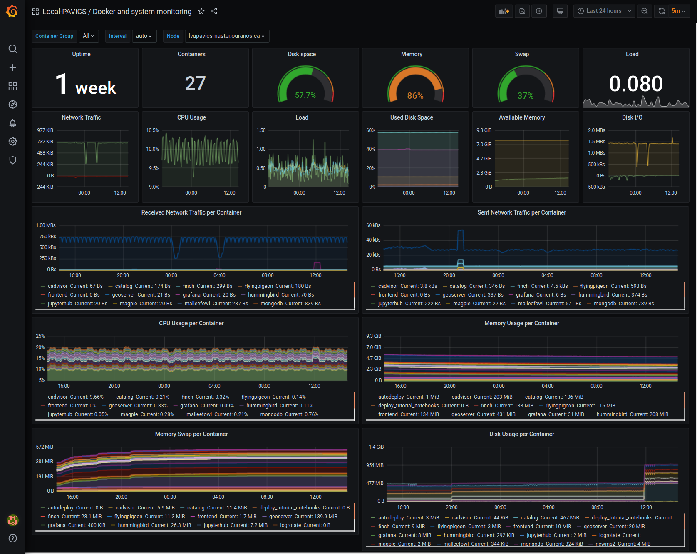
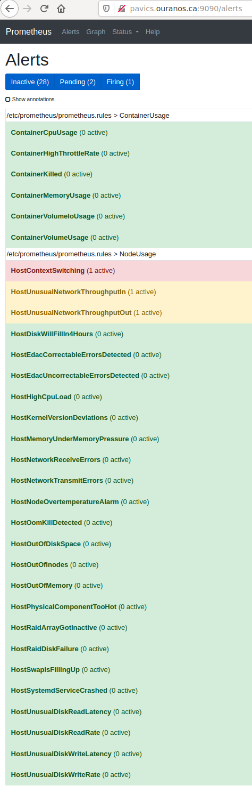
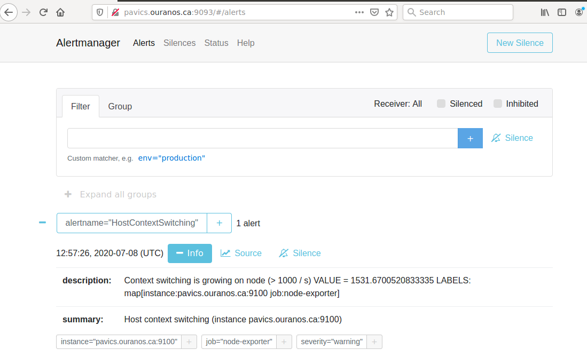
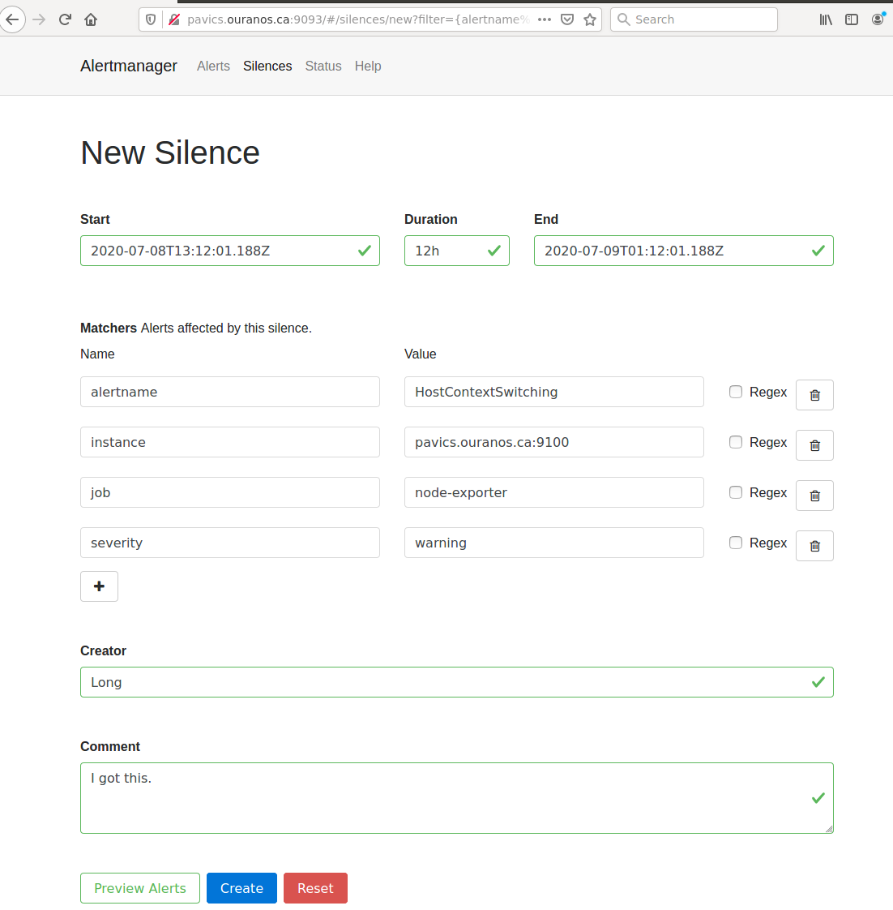
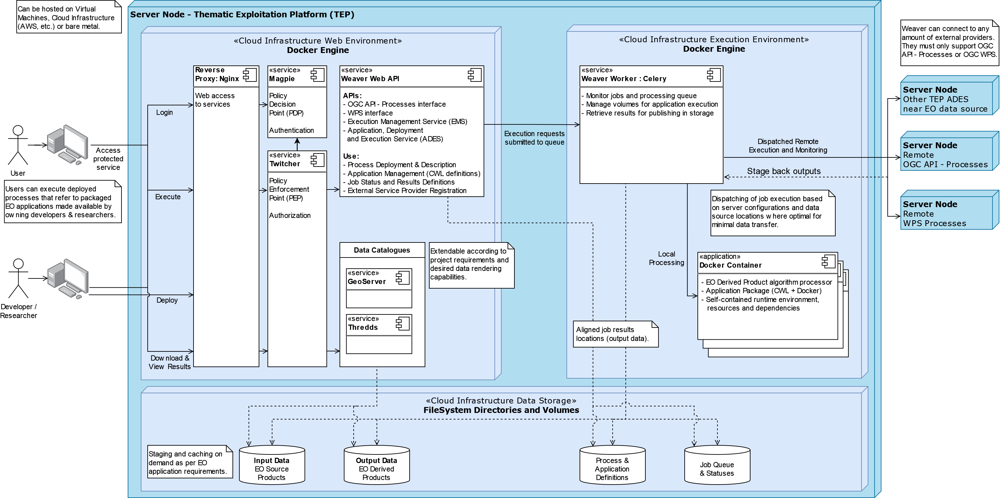

Birdhouse Components
#################

.. contents::

Scheduler
=========

The scheduler component runs specific jobs on a schedule. This is similar to using the `cron`
service but this runs in docker containers and is specifically designed to interact with the
Birdhouse stack.

Available jobs
-------------

Scheduler jobs can be enabled by enabling optional components. Birdhouse comes with a variety of
these jobs in the ``optional-components`` directory. To enable any of these jobs, add the relevant
component directory to the ``BIRDHOUSE_EXTRA_CONF_DIRS`` variable in your local environment file.

* Enable automatic deployment

  * additional description of this can be found in the :ref:`Automated Deployment` section

  * component location: ``optional-components/scheduler-job-autodeploy``

* Automatically rotate logs

  * rotate and manage the birdhouse log files located in the directory specified by ``BIRDHOUSE_LOG_DIR``.

  * component location: ``optional-components/scheduler-job-logrotate``

* Automatically update tutorial Jupyter notebooks

  * update tutorial notebooks that are displayed to users who run Jupyterlab servers through the ``jupyterhub`` component.

  * this requires that the ``jupyterhub`` component is also enabled

  * component location: ``optional-components/scheduler-job-notebookdeploy``

* Automatically renew LetsEncrypt SSL certificate
  * renew a SSL certificate issued by LetsEncrypt on a schedule
  * component location: ``optional-components/scheduler-job-renew_letsencrypt_ssl_cert``

* Automatically deploy xclim test data to THREDDS

  * adds xclim test data to the thredds server and keeps it up to date (for test purposes).

  * this requires that the ``thredds`` component is also enabled

  * component location: ``optional-components/scheduler-job-deploy_xclim_testdata``

* Automatically deploy raven test data to THREDDS

  * adds test data used by the raven WPS component to the thredds server and keeps it up to date (for test purposes).

  * this requires that the ``thredds`` and ``raven`` components also be enabled
  
  * component location: ``optional-components/scheduler-job-deploy_raven_testdata``

* Automatically backup files

  * automatically backs up application data, user data, and logs to a restic repository (default) or a docker volume

  * component location: ``optional-components/scheduler-job-backup``

For additional configuration options for all these jobs see the ``env.local.example`` file
as well as the individual ``default.env`` files in each of the component directories.

Custom jobs
-----------

To add custom jobs to the scheduler component, create a new component that mounts a ``.yml`` configuration file
to the ``/scheduler-job-configs/`` directory inside the ``scheduler`` container.

See the components listed above as examples on how to build a similar scheduler job component. For more information
about the syntax of the configuration files see the `documentation <https://github.com/Ouranosinc/docker-crontab/>`_.

The old way to add additional jobs is to update the ``BIRDHOUSE_AUTODEPLOY_EXTRA_SCHEDULER_JOBS``
environment variable in the local environment file to contain a YAML string that describes the job to run.

Note that this method is deprecated and may be removed in the future. Please update all jobs defined in the
``BIRDHOUSE_AUTODEPLOY_EXTRA_SCHEDULER_JOBS`` variable to components.

For example a simple additional job might look like:

.. code-block:: shell

  if [ -z "$(echo "$BIRDHOUSE_AUTODEPLOY_EXTRA_SCHEDULER_JOBS" | grep 'example job')" ]; then
    export BIRDHOUSE_AUTODEPLOY_EXTRA_SCHEDULER_JOBS="
  $BIRDHOUSE_AUTODEPLOY_EXTRA_SCHEDULER_JOBS
  - name: example job
    comment: basic job that echos 'something' every hour
    schedule: '1 * * * *'
    command: 'echo something'
    dockerargs: >-
      --rm --name example
  "
  fi

Note in the example above, the code first checks to make sure that there isn't already a job named ``example job``.
This is because the local environment file may be read multiple times when it is loaded so it is crucial to ensure that
jobs are not accidentally duplicated.

.. _Automated Deployment:

Automated Deployment
--------------------

This component provides automated unattended continuous deployment for the
"Birdhouse stack" (all the git repos in var ``BIRDHOUSE_AUTODEPLOY_EXTRA_REPOS``), for the
tutorial notebooks on the Jupyter environment and for the automated deployment
itself.

It can also be used to schedule other tasks on the Birdhouse physical host.

Everything is dockerized, the deployment runs inside a container that will
update all other containers.

Automated unattended continuous deployment means if code change in the remote
repo, matching the same currently checkout branch (ex: config changes,
``docker-compose.yml`` changes) a deployment will be performed automatically
without human intervention.

The trigger for the deployment is new code change on the server on the current
branch (PR merged, push). New code change locally will not trigger deployment
so local development workflow is also supported.

Multiple remote repos are supported so the "Birdhouse stack" can be made of
multiple checkouts for modularity and extensibility.  The autodeploy will
trigger if any of the checkouts (configured in ``BIRDHOUSE_AUTODEPLOY_EXTRA_REPOS``) is
not up-to-date with its remote repo.

A suggested "Birdhouse stack" is made of at least 2 repos, this repo and another
private repo containing the source controlled ``env.local`` file and any other
docker-compose override for true infrastructure-as-code.

Note: there are still cases where a human intervention is needed. See note in
script deploy.sh_ (:download:`download <../deployment/deploy.sh>`).

Usage
^^^^^

Given the unattended nature, there is no UI.  Logs are used to keep trace.

- ``${BIRDHOUSE_LOG_DIR}/autodeploy.log`` is for the Birdhouse deployment.

- ``${BIRDHOUSE_LOG_DIR}/notebookdeploy.log`` is for the tutorial notebooks deployment.

- logrotate is enabled for ``${BIRDHOUSE_LOG_DIR}/*.log`` to avoid filling up the
  disk.  Any new ``.log`` files in that folder will get logrotate for free.

How to Enable the Component
^^^^^^^^^^^^^^^^^^^^^^^^^^^

- Edit ``env.local`` (a copy of env.local.example_ (:download:`download <../env.local.example>`))

  - Add "./components/scheduler" to ``BIRDHOUSE_EXTRA_CONF_DIRS``.
  - Set ``BIRDHOUSE_AUTODEPLOY_EXTRA_REPOS``, ``BIRDHOUSE_AUTODEPLOY_DEPLOY_KEY_ROOT_DIR``,
    ``BIRDHOUSE_AUTODEPLOY_PLATFORM_FREQUENCY``, ``BIRDHOUSE_AUTODEPLOY_NOTEBOOK_FREQUENCY`` as desired,
    full documentation in `env.local.example`_.
  - Run once fix-write-perm_ (:download:`download <../deployment/fix-write-perm>`), see doc in script.

Old way to deploy the automatic deployment
^^^^^^^^^^^^^^^^^^^^^^^^^^^^^^^^^^^^^^^^^^

Superseded by this new ``scheduler`` component.  Keeping for reference only.

Doing it this old way do not need the ``scheduler`` component but lose the
ability for the autodeploy system to update itself.

Configure logrotate for all following automations to prevent disk full::

  deployment/install-logrotate-config .. $USER

To enable continuous deployment of Birdhouse::

  deployment/install-automated-deployment.sh .. $USER [daily|5-mins]
  # read the script for more options/details

If you want to manually force a deployment of Birdhouse (note this might not use
latest version of deploy.sh_ script (:download:`download <../deployment/deploy.sh>`)::

  deployment/deploy.sh .
  # read the script for more options/details

To enable continuous deployment of tutorial Jupyter notebooks::

  deployment/install-deploy-notebook .. $USER
  # read the script for more details

To trigger tutorial Jupyter notebooks deploy manually::

  # configure logrotate before because this script will log to
  # ${BIRDHOUSE_LOG_DIR}/notebookdeploy.log

  deployment/trigger-deploy-notebook
  # read the script for more details

Migrating to the new mechanism requires manual deletion of all the artifacts
created by the old install scripts: ``sudo rm /etc/cron.d/Birdhouse-deploy
/etc/cron.hourly/birdhouse-deploy-notebooks /etc/logrotate.d/Birdhouse-deploy
/usr/local/sbin/triggerdeploy.sh``.  Both can not co-exist at the same time.

Comparison between the old and new autodeploy mechanism
^^^^^^^^^^^^^^^^^^^^^^^^^^^^^^^^^^^^^^^^^^^^^^^^^^^^^^^

Maximum backward-compatibility has been kept with the old install scripts style:

* Still log to the same existing log files under ``${BIRDHOUSE_LOG_DIR}``.
* Old single ssh deploy key is still compatible, but the new mechanism allows for different ssh deploy keys for each
  extra repos (again, public repos should use https clone path to avoid dealing with ssh deploy keys in the first
  place).
* Old install scripts are kept and can still deploy the old way.

Features missing in old install scripts or how the new mechanism improves on the old install scripts:

* Autodeploy of the autodeploy itself !  This is the biggest win.  Previously, if triggerdeploy.sh_
  (:download:`download <../deployment/triggerdeploy.sh>`)
  or the deployed ``/etc/cron.hourly/birdhouse-deploy-notebooks`` script changes, they have to be deployed manually.
  It's very annoying.  Now they are volume-mount in so are fresh on each run.
* ``env.local`` now drives absolutely everything, source control that file and we've got a true DevOPS pipeline.
* Configurable platform and notebook autodeploy frequency.  Previously, this means manually editing the generated cron
  file, less ideal.
* Do not need any support on the local host other than ``docker`` and ``docker-compose``.  ``cron/logrotate/git/ssh``
  versions are all locked-down in the docker images used by the autodeploy.  Recall previously we had to deal with git
  version too old on some hosts.
* Each cron job run in its own docker image meaning the runtime environment is traceable and reproducible.
* The newly introduced scheduler component is made extensible so other jobs can added into it as well (ex: backup),
  via ``env.local``, which should be source controlled, meaning all surrounding maintenance related tasks can also be
  traceable and reproducible.

How to test platform autodeploy is not broken by a PR
^^^^^^^^^^^^^^^^^^^^^^^^^^^^^^^^^^^^^^^^^^^^^^^^^^^^^

There are 2 tests that need to be performed:

* Can autodeploy deploy the PR from ``master`` branch, the stable reference point?

  * This could fail if some changes in the PR are incompatible with autodeploy. For example: ``birdhouse compose`` calls some binaries that do not exist in the autodeploy docker image.

* Can autodeploy be triggered again successfully, after the PR is live?

  * This could fail if the PR renamed some files and forgot to add the old file names to a ``.gitignore`` file.  Then old file names will appear as new uncommitted files and autodeploy will halt because it expects a clean working directory.

Here is a sample setup to test autodeploy:

* Have 2 checkout directories.  One is for starting the stack using ``birdhouse compose``, the other one is to push new bogus changes to trigger the autodeploy mechanism.

.. code-block:: shell

  # this one for running birdhouse compose
  git clone git@github.com:bird-house/birdhouse-deploy.git birdhouse-deploy

  # this one for triggering autodeploy
  git clone git@github.com:bird-house/birdhouse-deploy.git birdhouse-deploy-trigger

* Set ``BIRDHOUSE_AUTODEPLOY_PLATFORM_FREQUENCY`` in ``env.local`` to a very frequent value so you do not have to wait too long for autodeploy to trigger.

.. code-block:: shell

  # go to the main checkout
  cd birdhouse-deploy/birdhouse

  # ensure the scheduler component is enabled, otherwise autodeploy will not work
  echo 'export BIRDHOUSE_EXTRA_CONF_DIRS="$BIRDHOUSE_EXTRA_CONF_DIRS ./components/scheduler" >> env.local

  # set BIRDHOUSE_AUTODEPLOY_PLATFORM_FREQUENCY
  # can set to more frequent than 5 minutes if your machine is capable enough
  echo 'export BIRDHOUSE_AUTODEPLOY_PLATFORM_FREQUENCY="@every 5m"' >> env.local

  # if scheduler container already running:
  # recreate scheduler container for new BIRDHOUSE_AUTODEPLOY_PLATFORM_FREQUENCY to be effective
  birdhouse compose stop scheduler && birdhouse compose rm -vf scheduler && birdhouse compose up -d

  # if scheduler container not running yet: start the newly added scheduler component
  birdhouse compose up -d

* Create a ``${USER}-test`` branch so you can add bogus commits without affecting your real PR.  Set up your main checkout (birdhouse-deploy) to track that test branch so it will detect new changes on the test branch and trigger the autodeploy.

.. code-block:: shell

  # go to the main checkout
  cd birdhouse-deploy/birdhouse

  # initially create the ${USER}-test branch from master
  # the ${USER} prefix is to avoid name clash if another user is also testing autodeploy
  git checkout master
  git pull
  git checkout -b ${USER}-test
  git push -u ${USER}-test

  # ensure your runnings code is at "master" and is working correctly
  # if you do not have a working baseline, you will not know if the breakage is due to autodeploy or your code
  birdhouse compose up -d

* Test scenario 1, from ``master`` to your PR

.. code-block:: shell

  # go to the other checkout to trigger autodeploy
  cd birdhouse-deploy-trigger/birdhouse

  # set branch ${USER}-test to the same commit as your PR, this will trigger autodeploy from master to your PR
  git pull
  git checkout ${USER}-test
  git reset --hard YOUR_PR_BRANCH
  git push

  # now that the remote "${USER}-test" branch differs from the local "${USER}-test" branch in the birdhouse-deploy repo,
  # the autodeploy mechanism will detect that the remote branch has changed and attempt to update the local branch

  # follow logs, check for errors
  tail -f ${BIRDHOUSE_LOG_DIR}/autodeploy.log

  # each autodeploy trigger will start the log with
  #   ==========
  #   triggerdeploy START_TIME=2023-06-15T05:07:01+0000

  # each autodeploy trigger will end the log with
  #   triggerdeploy finished START_TIME=2023-06-15T05:07:01+0000
  #   triggerdeploy finished   END_TIME=2023-06-15T05:07:06+0000

  # do spot checks in the log, run Jenkins on your deployment if needed

* Test scenario 2, from your PR to later changes

.. code-block:: shell

  # go to the other checkout to trigger autodeploy
  cd birdhouse-deploy-trigger/birdhouse

  # add any bogus commit to trigger autodeploy again
  echo >> README.rst
  git add README.rst
  git commit -m "trigger autodeploy"
  git push

  # now that the remote "${USER}-test" branch differs from the local "${USER}-test" branch in the birdhouse-deploy repo,
  # the autodeploy mechanism will detect that the remote branch has changed and attempt to update the local branch

  # follow logs, check for errors
  tail -f ${BIRDHOUSE_LOG_DIR}/autodeploy.log

* Test done, clean up the bogus ``${USER}-test`` branch and optionally relax ``BIRDHOUSE_AUTODEPLOY_PLATFORM_FREQUENCY``

.. code-block:: shell

  # go to the other checkout to trigger autodeploy
  cd birdhouse-deploy-trigger/birdhouse

  # go to master so we can delete the ${USER}-test branch
  git checkout master
  git push origin --delete ${USER}-test
  git branch -D ${USER}-test

  # go to the main checkout
  cd birdhouse-deploy/birdhouse

  # go to YOUR_PR_BRANCH so we can delete the ${USER}-test branch
  git checkout YOUR_PR_BRANCH
  git branch -D ${USER}-test

  # edit env.local and change BIRDHOUSE_AUTODEPLOY_PLATFORM_FREQUENCY to something less frequent to save your cpu
  # do not remove the scheduler component from the stack yet or the next command will fail

  # recreate scheduler container for new BIRDHOUSE_AUTODEPLOY_PLATFORM_FREQUENCY to be effective
  birdhouse compose stop scheduler && birdhouse compose rm -vf scheduler && birdhouse compose up -d

  # optionally edit env.local to remove the scheduler component from the stack
  # then remove the running scheduler container
  birdhouse compose up -d --remove-orphans

.. _Monitoring:

Monitoring
==========

This component provides monitoring and alerting for the Birdhouse physical host and containers.

Prometheus stack is used:

* Node-exporter to collect host metrics.
* cAdvisor to collect containers metrics.
* Prometheus to scrape metrics, to store them and to query them.
* AlertManager to manage alerts: deduplicate, group, route, silence, inhibit.
* Grafana to provide visualization dashboard for the metrics.

Usage
-----

- Grafana to view metric graphs: https://BIRDHOUSE_FQDN/grafana/d/pf6xQMWGz/docker-and-system-monitoring
- Prometheus alert rules: https://BIRDHOUSE_FQDN/prometheus/rules
- AlertManager to manage alerts: https://BIRDHOUSE_FQDN/alertmanager

The paths above are by default only accessible to a user logged in to magpie as an administrator or
as a member of group ``monitoring``.  These routes provide sensitive information about the
birdhouse-deploy software stack and the machine that it is running on. It is highly discouraged to
make these routes available to anyone who does not have proper access permissions.

Add existing users to the ``monitoring`` group to allow them access to the various monitoring WebUI.
This way, we do not need to share the ``MAGPIE_ADMIN_USERNAME`` user account and do not have to add them to the
``administrators`` group, which would give them too much permissions.

How to Enable the Component
---------------------------

- Edit ``env.local`` (a copy of `env.local.example`_ (:download:`download <../env.local.example>`))

  - Add "./components/monitoring" to ``BIRDHOUSE_EXTRA_CONF_DIRS``
  - Set ``GRAFANA_ADMIN_PASSWORD`` to login to Grafana
  - Set ``ALERTMANAGER_ADMIN_EMAIL_RECEIVER`` for receiving alerts
  - Set ``ALERTMANAGER_SMTP_SERVER`` for sending alerts
  - Optionally set

    - ``ALERTMANAGER_EXTRA_GLOBAL`` to further configure AlertManager
    - ``ALERTMANAGER_EXTRA_ROUTES`` to add more routes than email notification
    - ``ALERTMANAGER_EXTRA_INHIBITION`` to disable rule from firing
    - ``ALERTMANAGER_EXTRA_RECEIVERS`` to add more receivers than the admin emails

  - Alert thresholds can be customized by setting the various ``PROMETHEUS_*_ALERT``
    vars in ``env.local``.  The list of ``PROMETHEUS_*_ALERT`` vars are in
    monitoring_default.env_ (:download:`download <monitoring/default.env>`).

Grafana Dashboard
-----------------

For host, using Node-exporter to collect metrics:

- uptime
- number of container
- used disk space
- used memory, available memory, used swap memory
- load
- cpu usage
- in and out network traffic
- disk I/O

For each container, using cAdvisor to collect metrics:

- in and out network traffic
- cpu usage
- memory and swap memory usage
- disk usage

Useful visualisation features:

- zoom in one graph and all other graph update to match the same "time range" so we can correlate event
- view each graph independently for more details
- mouse over each data point will show value at that moment

Prometheus Alert Rules
----------------------

AlertManager for Alert Dashboard and Silencing
----------------------------------------------

.. _monitoring-customize-the-component

Customizing the Component
-------------------------

- To add more Grafana dashboard, volume-mount more ``*.json`` files to the
  grafana container.

- To add more Prometheus alert rules, volume-mount more ``*.rules`` files to
  the prometheus container.

- To disable existing Prometheus alert rules, add more Alertmanager inhibition
  rules using ``ALERTMANAGER_EXTRA_INHIBITION`` via ``env.local`` file.

- Other possible Alertmanager configs via ``env.local``:
  ``ALERTMANAGER_EXTRA_GLOBAL``, ``ALERTMANAGER_EXTRA_ROUTES`` (can route to
  Slack or other services accepting webhooks), ``ALERTMANAGER_EXTRA_RECEIVERS``.

Longterm Storage of Prometheus Metrics
--------------------------------------

Prometheus stores metrics for 90 days by default. This may be sufficient for some use cases but you may wish to store
some metrics for longer. In order to store certain metrics for a longer than 90 days, you can enable the following
additional components:

- :ref:`prometheus-longterm-metrics`: a second Prometheus instance used to collect the metrics that you want to store longterm
- :ref:`thanos`: a service that enables more efficient storage of the metrics collected by the :ref:`prometheus-longterm-metrics`
  component.
- :ref:`prometheus-longterm-rules`: adds some example rules to the monitoring Prometheus instance (the one deployed by this `monitoring` 
  component) that can be stored longterm by the `prometheus-longterm-metrics` component. 

.. note::
    A separate prometheus instance is necessary since the retention time for prometheus metrics is set at the 
    instance level. This means that increasing the retention time must be done for all metrics at once which is undesirable
    because you probably don't need to store every metric for a long period of time and you'll end up using a lot more
    disk space than needed.

If some or all of these additional components are enabled, they interact in the following way to store certain metrics for
longer than 90 days:

1. 
  - `recording rules`_ are added to the monitoring Prometheus instance (the one deployed by this `monitoring` component). These
    rules are any that have the `longterm-metrics` label. 
  - The metrics described by these rules are collected/calculated by the monitoring Prometheus instance. The monitoring Prometheus
    instance treats these rules the same as any other (ie. only stores them for 90 days by default).
  - To enable some example longterm `recording rules`_, enable the :ref:`prometheus-longterm-rules` component. You can also choose 
    to create your own rules (see :ref:`prometheus-longterm-metrics` for details on how to create these longterm metrics rules). 
2. 
  - The :ref:`prometheus-longterm-metrics` Prometheus instance collects/copies only the rules with the `longterm-metrics` label from the 
    monitoring Prometheus instance.
  - The :ref:`prometheus-longterm-metrics` Prometheus instance stores only these metrics for a custom duration (can be longer than
    90 days).
3. 
  - The :ref:`thanos` component can be deployed alongside the :ref:`prometheus-longterm-metrics` Prometheus instance in order to store
    the metrics that the :ref:`prometheus-longterm-metrics` Prometheus instance has already collected.
  - The :ref:`thanos` component collects the metrics collected by the :ref:`prometheus-longterm-metrics` Prometheus instance and
    stores them in an S3 object store. 
  - The :ref:`thanos` object store stores the metrics more efficiently, meaning that metrics can be stored for even longer and they'll
    take up less disk space than if they were just stored by the :ref:`prometheus-longterm-metrics` Prometheus instance. 

.. note::

  It is possible to deploy the :ref:`prometheus-longterm-metrics` Prometheus instance and the :ref:`thanos` instance on a different
  machine than the monitoring Prometheus instance. However, note that both the :ref:`prometheus-longterm-metrics` and :ref:`thanos`
  components *must* be deployed on the same machine (if both are in use). Also note that this is untested and may require serious 
  troubleshooting to work properly.

.. _recording rules: https://prometheus.io/docs/prometheus/latest/configuration/recording_rules/

Weaver
======

By enabling this component, the `Weaver`_ service will be integrated into the stack.

This component offers `OGC API - Processes`_ interface to WPS components (a.k.a `WPS-REST bindings` and
`WPS-T (Transactional)` support).
This provides a RESTful JSON interface with asynchronous WPS processes execution over remote instances.
Other WPS components of the birdhouse stack (`finch`_, `flyingpigeon`_, etc.) will also all be registered
under `Weaver`_ in order to provide a common endpoint to retrieve all available processes, and dispatch
their execution to the corresponding service.
Finally, `Weaver`_ also adds `Docker` image execution capabilities as a WPS process, allowing deployment
and execution of custom applications and workflows.

Usage
-----

Once this component is enabled, `Weaver`_ will be accessible at ``https://<BIRDHOUSE_FQDN_PUBLIC>/weaver`` endpoint,
where ``BIRDHOUSE_FQDN_PUBLIC`` is defined in your ``env.local`` file.

Full process listing (across WPS providers) should be available using request:

.. code-block::

    GET https://<BIRDHOUSE_FQDN_PUBLIC>/weaver/processes?providers=true

Please refer to the `Weaver OpenAPI`_ for complete description of available requests.
This description will also be accessible via ``https://<BIRDHOUSE_FQDN_PUBLIC>/weaver/api`` once the instance is started.

For any specific details about `Weaver`_ configuration parameters, functionalities or questions, please refer to its
`documentation <https://pavics-weaver.readthedocs.io/en/latest/>`_.

How to Enable the Component
---------------------------

- Edit ``env.local`` (a copy of `env.local.example`_)

  - Add ``./components/weaver`` to ``BIRDHOUSE_EXTRA_CONF_DIRS``.

  - Component ``birdhouse/optional-components/all-public-access`` should also be enabled to ensure that `Weaver`_
    can request ``GetCapabilities`` of every WPS provider to be registered. Publicly inaccessible services will not
    succeed registration and will not provide the WPS-REST interface.

Customizing the Component
-------------------------

- Edit ``env.local`` (a copy of `env.local.example`_)

  - Optionally, set any additional environment variable overrides amongst values defined in `weaver/default.env`_.

  - Optionally, mount any additional `Weaver`_-specific configuration files
    (see contents of ``birdhouse/components/weaver/config/weaver``) if extended functionalities need to be defined.
    Further ``docker-compose-extra.yml`` could be needed to define
    any other ``volumes`` entries where these component would need to be mounted to.

  - Optionally, set ``WEAVER_ALT_PREFIX`` with any desired prefix location to use as alternate alias
    for the ``/weaver/`` endpoint. The ``/weaver/`` endpoint will remain available.
    The ``WEAVER_ALT_PREFIX`` alias defines an *additional* equivalent location to access the service.
    By default ``/ogcapi`` is employed as a common value for this suite of OGC standards.

    Note that custom prefix values, if specified, should start with a leading ``/``, and leave out any trailing ``/``.
    The prefix can also use multiple levels as desired (e.g.: ``/my/custom/path``).

    If the original ``/weaver/`` endpoint is deemed sufficient, and you would rather omit this additional alias
    entirely, the ``WEAVER_ALT_PREFIX`` variable should be explicitly set to an empty value.

.. _finch: https://github.com/bird-house/finch
.. _flyingpigeon: https://github.com/bird-house/flyingpigeon
.. _Weaver: https://github.com/crim-ca/weaver
.. _Weaver OpenAPI: https://pavics-weaver.readthedocs.io/en/latest/api.html
.. _weaver/default.env: ./weaver/default.env
.. _OGC API - Processes: https://github.com/opengeospatial/ogcapi-processes
.. _env.local.example: ../env.local.example
.. _fix-write-perm: ../deployment/fix-write-perm
.. _deploy.sh: ../deployment/deploy.sh
.. _triggerdeploy.sh: ../deployment/triggerdeploy.sh
.. _monitoring_default.env: monitoring/default.env

Cowbird
=======

Cowbird is a middleware that manages interactions between various *birds* of the `bird-house`_ stack.

It relies on the existence of other services under a common architecture, but applies changes to the resources under
those services such that the complete ecosystem can seamlessly operate together (see |cowbird-diagram|_).

The code of this service is located in |cowbird-repo|_. Its documentation is provided on |cowbird-rtd|_.

.. _bird-house: https://github.com/bird-house/birdhouse-deploy
.. |cowbird-diagram| replace:: Components Diagram
.. _cowbird-diagram: https://github.com/Ouranosinc/cowbird/blob/master/docs/_static/cowbird_components.png
.. |cowbird-repo| replace:: Ouranosinc/cowbird
.. _cowbird-repo: https://github.com/Ouranosinc/cowbird
.. |cowbird-rtd| replace:: ReadTheDocs
.. _cowbird-rtd: https://pavics-cowbird.readthedocs.io/

Operations Performed by Cowbird
-------------------------------

- Synchronize Magpie user and group permissions between "corresponding files" located under different services.
  For example, THREDDS user-workspace files visualized in the catalog will be accessible by the same user under
  the corresponding user-workspace under GeoServer.
- Synchronize Weaver endpoints to retrieve equivalent definitions under various paths and access to generated WPS
  outputs following a job execution by a given user.
- Synchronize permissions between API endpoints and local storage files.
- Synchronize permissions and references based on event triggers and request callbacks.

Usage
-----

Cowbird is intended to work on its own, behind the scene, to apply any required resource synchronization between
the various services of the platform when changes are detected. Therefore, it does not require any explicit interaction
from users.

In case the platform maintainer desires to perform manual syncing operations with Cowbird, its REST API should be used.
It will be accessible under ``https://{BIRDHOUSE_FQDN_PUBLIC}/cowbird`` and details of available endpoints will be served
under ``/cowbird/api``. Note that Magpie administrator credentials will be required to access those endpoints.

How to Enable the Component
---------------------------

- Edit ``env.local`` (a copy of `env.local.example`_)
- Add ``./components/cowbird`` to ``BIRDHOUSE_EXTRA_CONF_DIRS``.

Customizing the Component
-------------------------

Cowbird can be affected by multiple variables defined globally on the
stack (i.e.: ``env.local``, a copy of `env.local.example`_). It also considers variables of other services such as
THREDDS, GeoServer, Magpie, etc. in order to perform required interactions between them.

By default, variables defined in |cowbird-default|_ will be used unless overridden in ``env.local``. To apply changes
define your custom values in ``env.local`` directly.

.. |cowbird-default| replace:: cowbird/default.env
.. _cowbird-default: ./cowbird/default.env

STAC
====

`STAC`_ is the common name of the REST API that implements the STAC specification, common representation of geospatial 
information.

.. _STAC: https://stacspec.org/en

Usage
-----

The STAC API can be browsed via the ``stac-browser`` component. By default, the browser will point to the STAC API 
exposed by the current stack instance. Once this component is enabled, STAC API will be accessible at 
``https://<BIRDHOUSE_FQDN_PUBLIC>/stac`` endpoint and the STAC browser will be available at
``https://<BIRDHOUSE_FQDN_PUBLIC>/stac-browser`` endpoint. In order to make the STAC browser the default entrypoint,
define the following in the ``env.local`` file::

  export BIRDHOUSE_PROXY_ROOT_LOCATION='return 302 ${BIRDHOUSE_PROXY_SCHEME}://\$host/stac-browser;'

Here is a sample search query using a CLI::

.. code-block:: shell

    pip install pystac-client
    stac-client search $PAVIS_FQDN/stac -q "variable_id=txgt_32" "scenario=ssp585"

Calls to the STAC API pass through Twitcher in order to validate authorization. Unauthenticated users will have 
read-only access by default to STAC API resources while members of the `stac-admin` group can create and modify 
resources. STAC Browser is not protected by any authorization mechanism.

How to Enable the Component
---------------------------

- Edit ``env.local`` (a copy of `env.local.example`_)
- Add ``./components/stac`` to ``BIRDHOUSE_EXTRA_CONF_DIRS``.

Canarie-API
===========

An endpoint monitoring tool that shows the current status of other components in the software stack.

Usage
-----

The service is available at ``${BIRDHOUSE_PROXY_SCHEME}://${BIRDHOUSE_FQDN_PUBLIC}/canarie``

How to Enable the Component
---------------------------

- Edit ``env.local`` (a copy of `env.local.example`_)
- Add ``./components/canarie`` to ``BIRDHOUSE_EXTRA_CONF_DIRS``.

data-volume
===========

Creates a named volume in docker that is shared between WPS and OGCAPI components. This volume will contain data shared
and used by these services.

Usage
-----

This component is transparent to the end-user as its role is to share data between other components in the stack.

How to Enable the Component
---------------------------

- Do not enable this component directly. It will be enabled as a dependency of other components

Finch
=====
Users of climate data are interested in specific indices such as the number of freeze-thaw cycles, the number of
degree-days of cooling, the duration of heatwaves, etc. This returns annual values of the most popular climate indices.

Usage
-----

The service is available at ``${BIRDHOUSE_PROXY_SCHEME}://${BIRDHOUSE_FQDN_PUBLIC}${TWITCHER_PROTECTED_PATH}/finch``

How to Enable the Component
---------------------------

- Edit ``env.local`` (a copy of `env.local.example`_)
- Add ``./components/finch`` to ``BIRDHOUSE_EXTRA_CONF_DIRS``.

Geoserver
=========

GeoServer is the reference implementation of the Open Geospatial Consortium (OGC) Web Feature Service (WFS) and Web
Coverage Service (WCS) standards, as well as a high performance certified compliant Web Map Service (WMS), compliant
Catalog Service for the Web (CSW) and implementing Web Processing Service (WPS). GeoServer forms a core component of the
Geospatial Web.

Usage
-----

The service is available at ``${BIRDHOUSE_PROXY_SCHEME}://${BIRDHOUSE_FQDN_PUBLIC}/geoserver``. For usage and
configuration options please refer to the `Geoserver documentation`_.

.. _Geoserver documentation: https://docs.geoserver.org

How to Enable the Component
---------------------------

- Edit ``env.local`` (a copy of `env.local.example`_)
- Add ``./components/geoserver`` to ``BIRDHOUSE_EXTRA_CONF_DIRS``.

Hummingbird
===========

A Web Processing Service for compliance checks used in the climate science community.

Usage
-----

The service is available at ``${BIRDHOUSE_PROXY_SCHEME}://${BIRDHOUSE_FQDN_PUBLIC}${TWITCHER_PROTECTED_PATH}/hummingbird``

How to Enable the Component
---------------------------

- Edit ``env.local`` (a copy of `env.local.example`_)
- Add ``./components/hummingbird`` to ``BIRDHOUSE_EXTRA_CONF_DIRS``.

Jupyterhub
==========

Portal used to launch and manage jupyterlab servers for users. This provides a managed development environment for
end-users.

Usage
-----

The service is available at ``${BIRDHOUSE_PROXY_SCHEME}://${BIRDHOUSE_FQDN_PUBLIC}/jupyter``. Users are able to log in to Jupyterhub using the
same user name and password as Magpie. They will then be able to launch a personal jupyterlab server.

How to Enable the Component
---------------------------

- Edit ``env.local`` (a copy of `env.local.example`_)
- Add ``./components/jupyterhub`` to ``BIRDHOUSE_EXTRA_CONF_DIRS``.
- Set the ``JUPYTERHUB_CRYPT_KEY`` environment variable

Magpie
======

Magpie is service for AuthN/AuthZ accessible via a REST API. It allows you to manage
User/Group/Service/Resource/Permission management and integrates with Twitcher.

Usage
-----

The service is available at ``${BIRDHOUSE_PROXY_SCHEME}://${BIRDHOUSE_FQDN_PUBLIC}/magpie``. For usage and configuration options please
refer to the `Magpie documentation`_.

.. _Magpie documentation: https://pavics-magpie.readthedocs.io

How to Enable the Component
---------------------------

- This component is enabled by default as it is required to securely run the stack

mongodb
=======

A NoSQL database used by various other components in the stack as a database backend.

Usage
-----

This component is directly visible to the end-user. It is used by other components in the stack.

How to Enable the Component
---------------------------

- Do not enable this component directly. It will be enabled as a dependency of other components.

postgres
========

A relational database used by various other components in the stack as a database backend.

Usage
-----

This component is directly visible to the end-user. It is used by other components in the stack.

How to Enable the Component
---------------------------

- Do not enable this component directly. It will be enabled as a dependency of other components

Proxy
=====

An nginx reverse proxy that serves all other components in the stack through a single proxy endpoint.

Usage
-----

This component is transparent to the end-user as its role is to serve data from other components in the software stack.

How to Enable the Component
---------------------------

- This component is enabled by default

Raven
=====

A suite of WPS processes to calibrate and run hydrological models, including geographical information retrieval and
processing as well as time series analysis.

Usage
-----

The service is available at ``${BIRDHOUSE_PROXY_SCHEME}://${BIRDHOUSE_FQDN_PUBLIC}${TWITCHER_PROTECTED_PATH}/raven``

How to Enable the Component
---------------------------

- Edit ``env.local`` (a copy of `env.local.example`_)
- Add ``./components/raven`` to ``BIRDHOUSE_EXTRA_CONF_DIRS``.

Thredds
=======

Climate Data Catalog and Format Renderers. See the `Thredds documentation`_ for details.

.. _Thredds documentation: https://www.unidata.ucar.edu/software/tds/

Usage
-----

The catalog is available at the ``${BIRDHOUSE_PROXY_SCHEME}://${BIRDHOUSE_FQDN_PUBLIC}/thredds`` endpoint.

How to Enable the Component
---------------------------

- Edit ``env.local`` (a copy of `env.local.example`_)
- Add ``./components/thredds`` to ``BIRDHOUSE_EXTRA_CONF_DIRS``.

Twitcher
========

Twitcher is a security proxy that provides secure access to other components in the stack. The proxy service uses OAuth2
access tokens to protect the OWS service access using Magpie permissions.

Usage
-----

Twitcher should always be used in conjunction with Magpie and should work already without any additional configuration.
For details please refer to the `twitcher documentation`_.

.. _twitcher documentation: https://twitcher.readthedocs.io/en/latest/

How to Enable the Component
---------------------------

- This component is enabled by default as it is required to securely run the stack

wps_outputs-volume
==================

Creates a named volume in docker that is shared between WPS and OGCAPI components. This volume will contain the outputs
of all processes executed by these services.

Usage
-----

All outputs from these processes will become available at the ``${BIRDHOUSE_PROXY_SCHEME}://${BIRDHOUSE_FQDN_PUBLIC}/wpsoutputs`` endpoint.

By default, this endpoint is not protected. To secure access to this endpoint it is highly recommended to enable the
`./optional-components/secure-data-proxy` component as well.

How to Enable the Component
---------------------------

- Do not enable this component directly. It will be enabled as a dependency of other components
