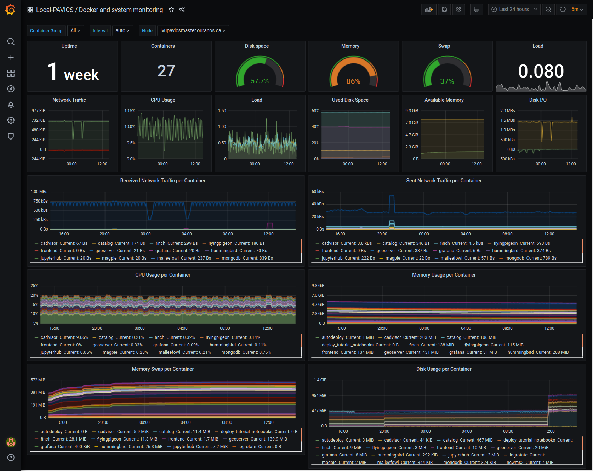
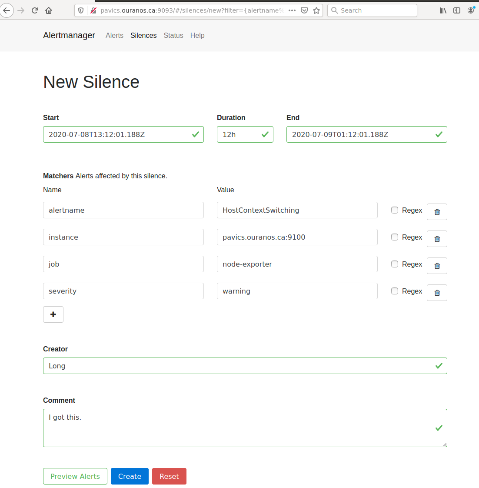

PAVICS Components
#################

.. contents::

Scheduler
=========

This component provides automated unattended continuous deployment for the
"PAVICS stack" (all the git repos in var ``AUTODEPLOY_EXTRA_REPOS``), for the
tutorial notebooks on the Jupyter environment and for the automated deployment
itself.

It can also be used to schedule other tasks on the PAVICS physical host.

Everything is dockerized, the deployment runs inside a container that will
update all other containers.

Automated unattended continuous deployment means if code change in the remote
repo, matching the same currently checkout branch (ex: config changes,
``docker-compose.yml`` changes) a deployment will be performed automatically
without human intervention.

The trigger for the deployment is new code change on the server on the current
branch (PR merged, push). New code change locally will not trigger deployment
so local development workflow is also supported.

Multiple remote repos are supported so the "PAVICS stack" can be made of
multiple checkouts for modularity and extensibility.  The autodeploy will
trigger if any of the checkouts (configured in ``AUTODEPLOY_EXTRA_REPOS``) is
not up-to-date with its remote repo.

A suggested "PAVICS stack" is made of at least 2 repos, this repo and another
private repo containing the source controlled ``env.local`` file and any other
docker-compose override for true infrastructure-as-code.

Note: there are still cases where a human intervention is needed. See note in
script deploy.sh_ (:download:`download <../deployment/deploy.sh>`).

Usage
-----

Given the unattended nature, there is no UI.  Logs are used to keep trace.

- ``/var/log/PAVICS/autodeploy.log`` is for the PAVICS deployment.

- ``/var/log/PAVICS/notebookdeploy.log`` is for the tutorial notebooks deployment.

- logrotate is enabled for ``/var/log/PAVICS/*.log`` to avoid filling up the
  disk.  Any new ``.log`` files in that folder will get logrotate for free.

How to Enable the Component
---------------------------

- Edit ``env.local`` (a copy of env.local.example_ (:download:`download <../env.local.example>`))

  - Add "./components/scheduler" to ``EXTRA_CONF_DIRS``.
  - Set ``AUTODEPLOY_EXTRA_REPOS``, ``AUTODEPLOY_DEPLOY_KEY_ROOT_DIR``,
    ``AUTODEPLOY_PLATFORM_FREQUENCY``, ``AUTODEPLOY_NOTEBOOK_FREQUENCY`` as desired,
    full documentation in `env.local.example`_.
  - Run once fix-write-perm_ (:download:`download <../deployment/fix-write-perm>`), see doc in script.

Old way to deploy the automatic deployment
------------------------------------------

Superseded by this new ``scheduler`` component.  Keeping for reference only.

Doing it this old way do not need the ``scheduler`` component but lose the
ability for the autodeploy system to update itself.

Configure logrotate for all following automations to prevent disk full::

  deployment/install-logrotate-config .. $USER

To enable continuous deployment of PAVICS::

  deployment/install-automated-deployment.sh .. $USER [daily|5-mins]
  # read the script for more options/details

If you want to manually force a deployment of PAVICS (note this might not use
latest version of deploy.sh_ script (:download:`download <../deployment/deploy.sh>`)::

  deployment/deploy.sh .
  # read the script for more options/details

To enable continuous deployment of tutorial Jupyter notebooks::

  deployment/install-deploy-notebook .. $USER
  # read the script for more details

To trigger tutorial Jupyter notebooks deploy manually::

  # configure logrotate before because this script will log to
  # /var/log/PAVICS/notebookdeploy.log

  deployment/trigger-deploy-notebook
  # read the script for more details

Migrating to the new mechanism requires manual deletion of all the artifacts
created by the old install scripts: ``sudo rm /etc/cron.d/PAVICS-deploy
/etc/cron.hourly/PAVICS-deploy-notebooks /etc/logrotate.d/PAVICS-deploy
/usr/local/sbin/triggerdeploy.sh``.  Both can not co-exist at the same time.

Comparison between the old and new autodeploy mechanism
-------------------------------------------------------

Maximum backward-compatibility has been kept with the old install scripts style:

* Still log to the same existing log files under ``/var/log/PAVICS``.
* Old single ssh deploy key is still compatible, but the new mechanism allows for different ssh deploy keys for each
  extra repos (again, public repos should use https clone path to avoid dealing with ssh deploy keys in the first
  place).
* Old install scripts are kept and can still deploy the old way.

Features missing in old install scripts or how the new mechanism improves on the old install scripts:

* Autodeploy of the autodeploy itself !  This is the biggest win.  Previously, if triggerdeploy.sh_
  (:download:`download <../deployment/triggerdeploy.sh>`)
  or the deployed ``/etc/cron.hourly/PAVICS-deploy-notebooks`` script changes, they have to be deployed manually.
  It's very annoying.  Now they are volume-mount in so are fresh on each run.
* ``env.local`` now drives absolutely everything, source control that file and we've got a true DevOPS pipeline.
* Configurable platform and notebook autodeploy frequency.  Previously, this means manually editing the generated cron
  file, less ideal.
* Do not need any support on the local host other than ``docker`` and ``docker-compose``.  ``cron/logrotate/git/ssh``
  versions are all locked-down in the docker images used by the autodeploy.  Recall previously we had to deal with git
  version too old on some hosts.
* Each cron job run in its own docker image meaning the runtime environment is traceable and reproducible.
* The newly introduced scheduler component is made extensible so other jobs can added into it as well (ex: backup),
  via ``env.local``, which should be source controlled, meaning all surrounding maintenance related tasks can also be
  traceable and reproducible.

Monitoring
==========

This component provides monitoring and alerting for the PAVICS physical host and containers.

Prometheus stack is used:

* Node-exporter to collect host metrics.
* cAdvisor to collect containers metrics.
* Prometheus to scrape metrics, to store them and to query them.
* AlertManager to manage alerts: deduplicate, group, route, silence, inhibit.
* Grafana to provide visualization dashboard for the metrics.

Usage
-----

- Grafana to view metric graphs: http://PAVICS_FQDN:3001/d/pf6xQMWGz/docker-and-system-monitoring
- Prometheus alert rules: http://PAVICS_FQDN:9090/rules
- AlertManager to manage alerts: http://PAVICS_FQDN:9093

The paths above are purposely not behind the proxy to not expose them publicly,
assuming only ports 80 and 443 are publicly exposed on the internet.  All other
ports are not exposed.

Only Grafana has authentication, Prometheus alert rules and AlertManager have
no authentication at all so had they been behind the proxy, anyone will be
able to access them.

How to Enable the Component
---------------------------

- Edit ``env.local`` (a copy of `env.local.example`_ (:download:`download <../env.local.example>`))

  - Add "./components/monitoring" to ``EXTRA_CONF_DIRS``
  - Set ``GRAFANA_ADMIN_PASSWORD`` to login to Grafana
  - Set ``ALERTMANAGER_ADMIN_EMAIL_RECEIVER`` for receiving alerts
  - Set ``SMTP_SERVER`` for sending alerts
  - Optionally set

    - ``ALERTMANAGER_EXTRA_GLOBAL`` to further configure AlertManager
    - ``ALERTMANAGER_EXTRA_ROUTES`` to add more routes than email notification
    - ``ALERTMANAGER_EXTRA_INHIBITION`` to disable rule from firing
    - ``ALERTMANAGER_EXTRA_RECEIVERS`` to add more receivers than the admin emails

  - Alert thresholds can be customized by setting the various ``PROMETHEUS_*_ALERT``
    vars in ``env.local``.  The list of ``PROMETHEUS_*_ALERT`` vars are in
    monitoring_default.env_ (:download:`download <monitoring/default.env>`).

Grafana Dashboard
-----------------

For host, using Node-exporter to collect metrics:

- uptime
- number of container
- used disk space
- used memory, available memory, used swap memory
- load
- cpu usage
- in and out network traffic
- disk I/O

For each container, using cAdvisor to collect metrics:

- in and out network traffic
- cpu usage
- memory and swap memory usage
- disk usage

Useful visualisation features:

- zoom in one graph and all other graph update to match the same "time range" so we can correlate event
- view each graph independently for more details
- mouse over each data point will show value at that moment

Prometheus Alert Rules
----------------------

.. image:: prometheus-alert-rules.png

AlertManager for Alert Dashboard and Silencing
----------------------------------------------

.. image:: alertmanager-dashboard.png

Customizing the Component
-------------------------

- To add more Grafana dashboard, volume-mount more ``*.json`` files to the
  grafana container.

- To add more Prometheus alert rules, volume-mount more ``*.rules`` files to
  the prometheus container.

- To disable existing Prometheus alert rules, add more Alertmanager inhibition
  rules using ``ALERTMANAGER_EXTRA_INHIBITION`` via ``env.local`` file.

- Other possible Alertmanager configs via ``env.local``:
  ``ALERTMANAGER_EXTRA_GLOBAL``, ``ALERTMANAGER_EXTRA_ROUTES`` (can route to
  Slack or other services accepting webhooks), ``ALERTMANAGER_EXTRA_RECEIVERS``.

Weaver
======

By enabling this component, the `Weaver`_ service will be integrated into the stack.

This component offers `OGC API - Processes`_ interface to WPS components (a.k.a `WPS-REST bindings` and
`WPS-T (Transactional)` support).
This provides a RESTful JSON interface with asynchronous WPS processes execution over remote instances.
Other WPS components of the birdhouse stack (`finch`_, `flyingpigeon`_, etc.) will also all be registered
under `Weaver`_ in order to provide a common endpoint to retrieve all available processes, and dispatch
their execution to the corresponding service.
Finally, `Weaver`_ also adds `Docker` image execution capabilities as a WPS process, allowing deployment
and execution of custom applications and workflows.

Usage
-----

Once this component is enabled, `Weaver`_ will be accessible at ``https://<PAVICS_FQDN_PUBLIC>/weaver`` endpoint,
where ``PAVICS_FQDN_PUBLIC`` is defined in your ``env.local`` file.

Full process listing (across WPS providers) should be available using request:

.. code-block::

    GET https://<PAVICS_FQDN_PUBLIC>/weaver/processes?providers=true

Please refer to the `Weaver OpenAPI`_ for complete description of available requests.
This description will also be accessible via ``https://<PAVICS_FQDN_PUBLIC>/weaver/api`` once the instance is started.

For any specific details about `Weaver`_ configuration parameters, functionalities or questions, please refer to its
`documentation <https://pavics-weaver.readthedocs.io/en/latest/>`_.

How to Enable the Component
---------------------------

- Edit ``env.local`` (a copy of `env.local.example`_)

  - Add ``"./components/weaver"`` to ``EXTRA_CONF_DIRS``.

  - Component ``birdhouse/optional-components/all-public-access`` should also be enabled to ensure that `Weaver`_
    can request ``GetCapabilities`` of every WPS provider to be registered. Publicly inaccessible services will not
    succeed registration and will not provide the WPS-REST interface.

Customizing the Component
-------------------------

- Edit ``env.local`` (a copy of `env.local.example`_)

  - Optionally, set any additional environment variable overrides amongst values defined in `weaver/default.env`_.

  - Optionally, mount any additional `Weaver`_-specific configuration files
    (see contents of ``birdhouse/components/weaver/config/weaver``) if extended functionalities need to be defined.
    Further ``docker-compose-extra.yml`` could be needed to define
    any other ``volumes`` entries where these component would need to be mounted to.

.. _finch: https://github.com/bird-house/finch
.. _flyingpigeon: https://github.com/bird-house/flyingpigeon
.. _Weaver: https://github.com/crim-ca/weaver
.. _Weaver OpenAPI: https://pavics-weaver.readthedocs.io/en/latest/api.html
.. _weaver/default.env: ./weaver/default.env
.. _OGC API - Processes: https://github.com/opengeospatial/ogcapi-processes
.. _env.local.example: ../env.local.example
.. _fix-write-perm: ../deployment/fix-write-perm
.. _deploy.sh: ../deployment/deploy.sh
.. _triggerdeploy.sh: ../deployment/triggerdeploy.sh
.. _monitoring_default.env: monitoring/default.env

Cowbird
=======

Cowbird is a middleware that manages interactions between various *birds* of the `bird-house`_ stack.

It relies on the existence of other services under a common architecture, but applies changes to the resources under
those services such that the complete ecosystem can seamlessly operate together (see |cowbird-diagram|_).

The code of this service is located in |cowbird-repo|_. Its documentation is provided on |cowbird-rtd|_.

.. _bird-house: https://github.com/bird-house/birdhouse-deploy
.. |cowbird-diagram| replace:: Components Diagram
.. _cowbird-diagram: https://github.com/Ouranosinc/cowbird/blob/master/docs/_static/cowbird_components.png
.. |cowbird-repo| replace:: Ouranosinc/cowbird
.. _cowbird-repo: https://github.com/Ouranosinc/cowbird
.. |cowbird-rtd| replace:: ReadTheDocs
.. _cowbird-rtd: https://pavics-cowbird.readthedocs.io/

Operations Performed by Cowbird
-------------------------------

- Synchronize Magpie user and group permissions between "corresponding files" located under different services.
  For example, THREDDS user-workspace files visualized in the catalog will be accessible by the same user under
  the corresponding user-workspace under GeoServer.
- Synchronize Weaver endpoints to retrieve equivalent definitions under various paths and access to generated WPS
  outputs following a job execution by a given user.
- Synchronize permissions between API endpoints and local storage files.
- Synchronize permissions and references based on event triggers and request callbacks.

Usage
-----

Cowbird is intended to work on its own, behind the scene, to apply any required resource synchronization between
the various services of the platform when changes are detected. Therefore, it does not require any explicit interaction
from users.

In case the platform maintainer desires to perform manual syncing operations with Cowbird, its REST API should be used.
It will be accessible under ``https://{PAVICS_FQDN_PUBLIC}/cowbird`` and details of available endpoints will be served
under ``/cowbird/api``. Note that Magpie administrator credentials will be required to access those endpoints.

How to Enable the Component
---------------------------

- Edit ``env.local`` (a copy of `env.local.example`_)
- Add ``"./components/cowbird"`` to ``EXTRA_CONF_DIRS``.

Customizing the Component
-------------------------

Cowbird can be affected by multiple variables defined globally on the
stack (i.e.: ``env.local``, a copy of `env.local.example`_). It also considers variables of other services such as
THREDDS, GeoServer, Magpie, etc. in order to perform required interactions between them.

By default, variables defined in |cowbird-default|_ will be used unless overridden in ``env.local``. To apply changes
define your custom values in ``env.local`` directly.

.. |cowbird-default| replace:: cowbird/default.env
.. _cowbird-default: ./cowbird/default.env
