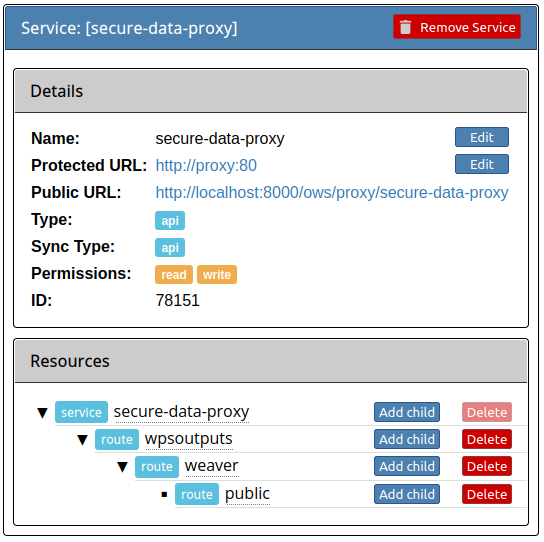

Optional components
===================

.. contents::

Monitor all components in CANARIE node, both public and internal url
--------------------------------------------------------------------

So that the url ``https://<PAVICS_FQDN>/canarie/node/service/stats`` also return
what the end user really see (a component might work but is not accessible to
the end user).

This assume all the WPS services are public.  If not the case, make a copy of
this config and adjust accordingly.

How to enable this config in ``env.local`` (a copy from env.local.example_
(:download:`download </birdhouse/env.local.example>`)):

* Add ``./optional-components/canarie-api-full-monitoring`` to ``EXTRA_CONF_DIRS``.

Emu WPS service for testing
---------------------------

Preconfigured for Emu but can also be used to quickly deploy any birds
temporarily without changing code.  Good to preview new birds or test
alternative configuration of existing birds.

No Postgres DB configured.  If need Postgres DB, use generic_bird component
instead.

How to enable Emu in ``env.local`` (a copy from env.local.example_
(:download:`download </birdhouse/env.local.example>`)):

* Add ``./optional-components/emu`` to ``EXTRA_CONF_DIRS``.
* Optionally set ``EMU_IMAGE``, ``EMU_PORT``,
  ``EMU_NAME``, ``EMU_INTERNAL_PORT``,
  ``EMU_WPS_OUTPUTS_VOL`` in ``env.local`` for further customizations.
  Default values are in `optional-components/emu/default.env <emu/default.env>`_
  (:download:`download </birdhouse/optional-components/emu/default.env>`).

Emu service will be available at ``http://PAVICS_FQDN:EMU_PORT/wps`` or
``https://PAVICS_FQDN_PUBLIC/TWITCHER_PROTECTED_PATH/EMU_NAME`` where
``PAVICS_FQDN``\ , ``PAVICS_FQDN_PUBLIC`` and ``TWITCHER_PROTECTED_PATH`` are defined
in your ``env.local``.

Magpie will be automatically configured to give complete public anonymous
access for this Emu WPS service.

CANARIE monitoring will also be automatically configured for this Emu WPS
service.

A second THREDDS server for testing
-----------------------------------

How to enable in ``env.local`` (a copy from env.local.example_ (:download:`download </birdhouse/env.local.example>`)):

* Add ``./optional-components/testthredds`` to ``EXTRA_CONF_DIRS``.

* Optionally set ``TESTTHREDDS_IMAGE``\ , ``TESTTHREDDS_PORT``\ ,
  ``TESTTHREDDS_CONTEXT_ROOT``\ , ``TESTTHREDDS_WARFILE_NAME``\ ,
  ``TESTTHREDDS_INTERNAL_PORT``\ , ``TESTTHREDDS_NAME``\ ,  in ``env.local`` for further
  customizations.  Default values are in: `optional-components/testthredds/default.env <testthredds/default.env>`_ (:download:`download </birdhouse/optional-components/testthredds/default.env>`).

Test THREDDS service will be available at
``http://PAVICS_FQDN:TESTTHREDDS_PORT/TESTTHREDDS_CONTEXT_ROOT`` or
``https://PAVICS_FQDN_PUBLIC/TESTTHREDDS_CONTEXT_ROOT`` where ``PAVICS_FQDN`` and
``PAVICS_FQDN_PUBLIC`` are defined in your ``env.local``.

Use same docker image as regular THREDDS by default but can be customized.

New container have new ``TestDatasets`` with volume-mount to ``/data/testdatasets``
on the host.  So your testing ``.nc`` and ``.ncml`` files should be added to
``/data/testdatasets`` on the host for them to show up on this Test THREDDs
server.

``TestWps_Output`` dataset is for other WPS services to write to, similar to
``birdhouse/wps_outputs`` dataset in the production THREDDs.  With Emu, add
``export EMU_WPS_OUTPUTS_VOL=testwps_outputs`` to ``env.local`` for Emu to write to
``TestWps_Output`` dataset.

No Twitcher/Magpie access control, this Test THREDDS is directly behind the
Nginx proxy.

CANARIE monitoring will also be automatically configured for this second
THREDDS server.

A generic bird WPS service
--------------------------

Can be used to quickly deploy any birds temporarily without changing code.
Good to preview new birds or test alternative configuration of existing birds.

How to enable in ``env.local`` (a copy from env.local.example_ (:download:`download </birdhouse/env.local.example>`)):

* Add ``./optional-components/generic_bird`` to ``EXTRA_CONF_DIRS``.

* Optionally set ``GENERIC_BIRD_IMAGE``, ``GENERIC_BIRD_PORT``,
  ``GENERIC_BIRD_NAME``, ``GENERIC_BIRD_INTERNAL_PORT``, and
  ``GENERIC_BIRD_POSTGRES_IMAGE`` in ``env.local`` for further customizations.
  Default values are in `optional-components/generic_bird/default.env <generic_bird/default.env>`_
  (:download:`download </birdhouse/optional-components/generic_bird/default.env>`).

The WPS service will be available at ``http://PAVICS_FQDN:GENERIC_BIRD_PORT/wps``
or ``https://PAVICS_FQDN_PUBLIC/TWITCHER_PROTECTED_PATH/GENERIC_BIRD_NAME`` where
``PAVICS_FQDN``\ , ``PAVICS_FQDN_PUBLIC`` and ``TWITCHER_PROTECTED_PATH`` are defined
in your ``env.local``.

Use same docker image as regular Finch by default but can be customized.

Use a separate Postgres DB for this optional component to be completely
self-contained and to allow experimenting with different versions of Postgres
DB.

Magpie will be automatically configured to give complete public anonymous
access for this WPS service.

CANARIE monitoring will also be automatically configured for this WPS service.

Enable health checks for WPS services
--------------------------------------------------------

At any given time, WPS services could stop responding. Using the ``healthcheck`` feature from ``docker-compose``, it is
possible to monitor the services at regular intervals to ensure they remain accessible. Using this, it is possible to
rapidly identify if a service might be misbehaving.

Since the various WPS services are executed using a different applications and dependencies in their respective
Docker images, the method required to validate their status can vary a lot for each case. This optional component
defines all the appropriate ``healthcheck`` for all known WPS services in PAVICS.

How to enable in ``env.local`` (a copy from env.local.example_ (:download:`download </birdhouse/env.local.example>`)):

* Add ``./optional-components/wps-healthchecks`` to ``EXTRA_CONF_DIRS``.

Once enabled, every WPS service will be monitored at regular intervals and ``docker-compose`` will indicate in their
health status. Command ``pavics-compose ps`` can be employed to list running images, and along with it, the statuses
reported by each ``healthcheck``.

.. _magpie-public-access-config:

Give public access to all resources for testing purposes
--------------------------------------------------------

By enabling this component, all WPS services and data on THREDDS are completely public, please beware.
Once enabled, if you need to revert the change, you have to do it manually by logging into Magpie.
Just disabling this component will not revert the change.
Alternatively, you can create a similar file to |magpie-public-perms|_ and replace all desired ``action: create``
entries by ``action: remove`` to make sure the permissions are removed at startup if they exist.

This optional component is required for the test suite at
https://github.com/Ouranosinc/PAVICS-e2e-workflow-tests.

How to enable in ``env.local`` (a copy from `env.local.example`_ (:download:`download </birdhouse/env.local.example>`)):

* Add ``./optional-components/all-public-access`` to ``EXTRA_CONF_DIRS``.

The anonymous user will now have all the permissions described in |magpie-public-perms|_
(:download:`download </birdhouse/optional-components/all-public-access/all-public-access-magpie-permission.cfg>`).

.. _magpie-public-perms: ./all-public-access/all-public-access-magpie-permission.cfg
.. |magpie-public-perms| replace:: optional-components/all-public-access/all-public-access-magpie-permission.cfg
.. _env.local.example: ../env.local.example

Control secured access to WPS outputs
--------------------------------------------------------

By default, all outputs of WPS processes (i.e.: ``/wpsoutputs``) are publicly accessible. This is to preserve
backward compatibility with previous instances. However, enabling this optional component adds secured access to data
stored under ``/wpsoutputs``.

To provide secured access, all requests sent to ``/wpsoutputs`` require a prior authorization from a new service added
to Magpie, called ``secure-data-proxy``. As shown below, this service should replicate the file system directory
hierarchy defined to store the data. A file located under ``/wpsoutputs/weaver/public`` for example would use the
corresponding resources and user/group permissions defined under this service to validate that the authenticated
request user can obtain access to it.

How to enable in ``env.local`` (a copy from `env.local.example`_ (:download:`download </birdhouse/env.local.example>`)):

* Add ``./optional-components/secure-data-proxy`` to ``EXTRA_CONF_DIRS``.

Once enabled, users will *NOT* have public access to files under ``/wpsoutputs`` anymore, except for items defined
with authorized ``read`` permissions for the ``anonymous`` group under |secure-data-proxy-perms|_. As any other Magpie
configuration file, any combination of user/group/resource/permission could be defined for the ``secure-data-proxy``
service to customize specific user access control to stored data files.

.. _secure-data-proxy-perms: ./secure-data-proxy/config/magpie/config.yml.template
.. |secure-data-proxy-perms| replace:: optional-components/secure-data-proxy/config/magpie/config.yml.template

Control secured access to resources example
--------------------------------------------------------

Optional configuration |magpie-secure-perms|_ is provided as example to illustrate how to apply permissions on specific
THREDDS resources to limit their access publicly. This permission configuration can be combined with others, such as
`magpie-public-access-config`_ ones to formulate specific permissions schemes that matches your data structure and
desired access rules.

How to enable in ``env.local`` (a copy from `env.local.example`_ (:download:`download </birdhouse/env.local.example>`)):

* Add ``./optional-components/secure-thredds`` to ``EXTRA_CONF_DIRS``.

The anonymous user will *NOT* have access anymore to THREDDS test directory ``birdhouse/testdata/secure`` and any other
directories and files under it. Directories above and next to ``secure`` will still be accessible if
`magpie-public-access-config`_ component was also enabled.

On a typical server, custom and private permission rules should be provided in a similar fashion to ensure that
each time a new instance is booted, the same scheme of access configuration is applied. Permissions applied manually
into Magpie will not be replicated onto other server instance.

.. _magpie-secure-perms: ./secure-thredds/secure-access-magpie-permission.cfg
.. |magpie-secure-perms| replace:: optional-components/secure-thredds/secure-access-magpie-permission.cfg

Control public exposure of database ports
--------------------------------------------------------

Because databases may contain sensitive of private data, they should never be directly exposed.
On the other hand, accessing them remotely can be practical for testing such as in a staging server environment.

This component is intended to automatically map the databases (``PostgreSQL``, ``MongoDB``) as such.

How to enable in ``env.local`` (a copy from env.local.example_ (:download:`download </birdhouse/env.local.example>`)):

* Add ``./optional-components/database-external-ports`` to ``EXTRA_CONF_DIRS``.

That's it. Databases will be accessible using the mapped ports in then optional component configuration.

Test Permissions for Weaver
--------------------------------------------------------

In order to test functionalities offered by `Weaver` component ``./components/weaver``, this optional component
adds `Magpie` permissions to a test server in order to grant access to specific endpoints.
This will open public access to specified resources in file |test-weaver-perms|_.

.. warning::
    It also disables SSL verification for the corresponding process that is granted public access to allow `Weaver` to
    requests its WPS execution through the providers reference without error. This is mainly to ignore test servers
    self-signed SSL certificates. This should be avoided on production servers by using a real and valid SSL certificate
    and leaving verification active to avoid man-in-the-middle attacks.

This optional component is intended to be employed in combination with test notebook |pavics-sdi-weaver|_.

How to enable in ``env.local`` (a copy from `env.local.example`_ (:download:`download </birdhouse/env.local.example>`)):

* Add ``./optional-components/test-weaver`` to ``EXTRA_CONF_DIRS``

.. note::
    Definition ``./components/weaver`` is also expected to be in ``EXTRA_CONF_DIRS`` for permissions to have any effect.
    Ensure that ``./optional-components/test-weaver`` is placed **AFTER** ``./components/weaver``. Otherwise, the
    ``request_options.yml`` override applied by this optional component will be discarded by the main component.

.. _test-weaver-perms: ./optional-components/test-weaver/config/magpie/test-weaver-permission.cfg
.. |test-weaver-perms| replace:: optional-components/test-weaver/config/magpie/test-weaver-permission.cfg
.. _pavics-sdi-weaver|: https://github.com/Ouranosinc/pavics-sdi/blob/master/docs/source/notebook-components/weaver_example.ipynb
.. |pavics-sdi-weaver| replace:: Ouranosinc/pavics-sdi Weaver Example

Test Geoserver Secured Access
-----------------------------

This optional component adds a new provider and location for Geoserver, ``test-geoserver-secured-access``, 
in order to test secured access to this service before it is moved behind Twitcher (undetermined date).

The old ``/geoserver`` path is still available, so current workflows are not affected.

The new ``/geoserver-secured`` path is available for testing once the optional component is activated.

To test the ``geoserver-secured`` service through Magpie, each workspace needs to be added to the new service and then 
permissions can be set on a per-workspace or even layer basis.

A ``GetFeature`` request for a layer in a public workspace (named public in this example) will succeed for any user 
using any of these two request types:

* {BASE_URL}/geoserver-secured/wfs?version=2.0.0&request=GetFeature&typeNames=public:{LAYER_NAME}
* {BASE_URL}/geoserver-secured/public/wfs?version=2.0.0&request=GetFeature&typeNames={LAYER_NAME}

Whereas access to a private workspace will require a user or group be given explicit permissions through the ``Magpie``
interface.

See |geoserver_secured_pr|_. for more details.

.. _geoserver_secured_pr: https://github.com/bird-house/birdhouse-deploy/pull/242
.. |geoserver_secured_pr| replace:: Pull Request

Populate STAC catalog with sample data
--------------------------------------------------------

STAC Populator contains the workflow logic to ingest sample STAC item into the STAC catalog.

Once enabled in the stack, this component will run automatically on stack boot time in order to populate the catalog. 
On stack initialization, STAC item generation workflows will run for ``STAC_ASSET_GENERATOR_TIMEOUT`` seconds in order 
to populate the catalog with sample data. Change this timeout as needed, as there are no impact on the stack boot, 
except time required to feed the catalog.

To enable this optional-component:

- Edit ``env.local`` (a copy of `env.local.example`_)
- Add ``./optional-components/stac-populator`` to ``EXTRA_CONF_DIRS``.

Allow public access to STAC catalog
--------------------------------------------------------

STAC Public Access allows STAC catalog to be accessed by anyone, without authentication.

To enable this optional-component:

- Edit ``env.local`` (a copy of `env.local.example`_)
- Add ``./optional-components/stac-public-access`` to ``EXTRA_CONF_DIRS``.
