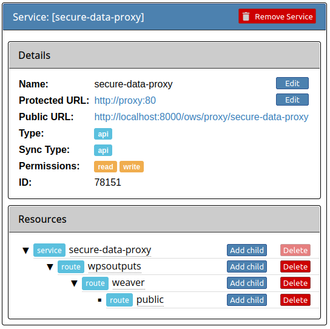

Optional components
===================

.. shared references by multiple components definitions
.. the short form refers to the "header" of the components section, for reference of a service by name
.. the long form can be used to refer to the component itself, such as when to include it in a configuration
.. links to section anchors use HTML form purposely to work both on GitHub and Sphinx rendered documentation
.. see 'docs/source/conf.py:convert_rst_links_to_html'
.. |magpie| replace:: Magpie
.. _magpie: ../components/README.rst#magpie
.. |components-magpie| replace:: ``./components/magpie``
.. _components-magpie: ../components/README.rst#magpie
.. |twitcher| replace:: Twitcher
.. _twitcher: ../components/README.rst#twitcher
.. |components-twitcher| replace:: ``./components/twitcher``
.. _components-twitcher: ../components/README.rst#twitcher
.. |weaver| replace:: Weaver
.. _weaver: ../components/README.rst#weaver
.. |components-weaver| replace:: ``./components/weaver``
.. _components-weaver: ../components/README.rst#weaver
.. |stac| replace:: STAC
.. _stac: ../components/README.rst#stac
.. |components-stac| replace:: ``./components/stac``
.. _components-stac: ../components/stac
.. |dggs| replace:: DGGS
.. _dggs: ../components/README.rst#dggs
.. |components-dggs| replace:: ``./components/dggs``
.. _components-dggs: ../components/README.rst#dggs
.. |thredds| replace:: THREDDS
.. _thredds: ../components/README.rst#thredds
.. |components-canarie-api| replace:: ``./components/canarie-api``
.. _components-canarie-api: ../components/README.rst#canarie-api
.. |components-proxy| replace:: ``proxy``
.. _components-proxy: ../components/README.rst#proxy
.. |env.local.example| replace:: ``env.local.example``
.. _env.local.example: ../env.local.example
.. |components-wps_outputs-volume| replace:: ``./components/wps_outputs-volume``
.. _components-wps_outputs-volume: ../components/wps_outputs-volume

.. contents::

.. |optional-components-canarie-monitoring| replace:: ``./optional-components/canarie-api-full-monitoring``
.. _optional-components-canarie-monitoring:

Monitor all components in CANARIE node, both public and internal URL
--------------------------------------------------------------------

So that the URL ``https://<BIRDHOUSE_FQDN>/canarie/node/service/stats`` also return
what the end user really see (a component might work but is not accessible to
the end user).

This assume all the WPS services are public.  If not the case, make a copy of
this config and adjust accordingly.

How to enable this config in ``env.local`` (a copy from |env.local.example|_):

* Add |optional-components-canarie-monitoring|_ to ``BIRDHOUSE_EXTRA_CONF_DIRS``.

.. _optional-components-scheduler-jobs:
.. _scheduler-jobs:

Scheduler Jobs
---------------------------

All jobs depend on the |components-scheduler|_ component.
Refer to its documentation for more details about the scheduler and its functionalities.

.. note::

    The |components-scheduler|_ MUST be added explicitly to ``BIRDHOUSE_EXTRA_CONF_DIRS``.
    The respective jobs will NOT auto-include it as ``COMPONENT_DEPENDENCIES`` in order to allow quick configuration
    and activation/deactivation of the main component without the need to configure each job individually.

Following are the available jobs that are predefined for convenience.
Further custom jobs can be added by following the instructions in the |components-scheduler|_ documentation.

.. |components-scheduler| replace:: ``./components/scheduler``
.. _components-scheduler: ../components/README.rst#scheduler

.. |optional-components-scheduler-job-autodeploy| replace:: ``./optional-components/scheduler-job-autodeploy``
.. _optional-components-scheduler-job-autodeploy:

Scheduler Job - Autodeploy
~~~~~~~~~~~~~~~~~~~~~~~~~~~~

Enable automatic deployment.

Additional description of this can be found in the :ref:`Automated Deployment` section.

How to enable in ``env.local`` (a copy from |env.local.example|_):

* Add |optional-components-scheduler-job-autodeploy|_ to ``BIRDHOUSE_EXTRA_CONF_DIRS``.

.. |optional-components-scheduler-job-logrotate| replace:: ``./optional-components/scheduler-job-logrotate``
.. _optional-components-scheduler-job-logrotate:

Scheduler Job - Log Rotate
~~~~~~~~~~~~~~~~~~~~~~~~~~~~

Automatically rotate and manage the birdhouse log files located in the directory specified by ``BIRDHOUSE_LOG_DIR``.

How to enable in ``env.local`` (a copy from |env.local.example|_):

* Add |optional-components-scheduler-job-logrotate|_ to ``BIRDHOUSE_EXTRA_CONF_DIRS``.

.. |optional-components-scheduler-job-logrotate-nginx| replace:: ``./optional-components/scheduler-job-logrotate-nginx``
.. _optional-components-scheduler-job-logrotate-nginx:

Scheduler Job - Log Rotate Nginx
~~~~~~~~~~~~~~~~~~~~~~~~~~~~~~~~

Creates a configuration to automatically rotate and manage the |components-proxy|_ log files.
It is relevant to rotate those files when they are parsed by |components-canarie-api|_ for service access
and monitoring purposes, to avoid parsing excessively large log files.

How to enable in ``env.local`` (a copy from |env.local.example|_):

* Add |optional-components-scheduler-job-logrotate-nginx|_ to ``BIRDHOUSE_EXTRA_CONF_DIRS``.

.. |optional-components-scheduler-job-notebookdeploy| replace:: ``./optional-components/scheduler-job-notebookdeploy``
.. _optional-components-scheduler-job-notebookdeploy:

Scheduler Job - Notebook Deploy
~~~~~~~~~~~~~~~~~~~~~~~~~~~~~~~~~

Automatically update tutorial notebooks that are displayed to users who run Jupyterlab servers
through the ``jupyterhub`` component.

This requires that the ``jupyterhub`` component is also enabled.

How to enable in ``env.local`` (a copy from |env.local.example|_):

* Add |optional-components-scheduler-job-notebookdeploy|_ to ``BIRDHOUSE_EXTRA_CONF_DIRS``.

.. |optional-components-scheduler-job-renew-letsencrypt-ssl-cert| replace:: ``./optional-components/scheduler-job-renew_letsencrypt_ssl_cert``
.. _optional-components-scheduler-job-renew-letsencrypt-ssl-cert:

Scheduler Job - Renew LetsEncrypt SSL Certificate
~~~~~~~~~~~~~~~~~~~~~~~~~~~~~~~~~~~~~~~~~~~~~~~~~~~

Automatically renew an SSL certificate issued by LetsEncrypt on a schedule.

How to enable in ``env.local`` (a copy from |env.local.example|_):

* Add |optional-components-scheduler-job-renew-letsencrypt-ssl-cert|_ to ``BIRDHOUSE_EXTRA_CONF_DIRS``.

.. |optional-components-scheduler-job-deploy-xclim-testdata| replace:: ``./optional-components/scheduler-job-deploy_xclim_testdata``
.. _optional-components-scheduler-job-deploy-xclim-testdata:

Scheduler Job - Deploy xclim Test Data
~~~~~~~~~~~~~~~~~~~~~~~~~~~~~~~~~~~~~~~~

Automatically deploy xclim test data to the thredds server and keeps it up to date (for test purposes).

This requires that the ``thredds`` component is also enabled.

How to enable in ``env.local`` (a copy from |env.local.example|_):

* Add |optional-components-scheduler-job-deploy-xclim-testdata|_ to ``BIRDHOUSE_EXTRA_CONF_DIRS``.

.. |optional-components-scheduler-job-deploy-raven-testdata| replace:: ``./optional-components/scheduler-job-deploy_raven_testdata``
.. _optional-components-scheduler-job-deploy-raven-testdata:

Scheduler Job - Deploy raven Test Data
~~~~~~~~~~~~~~~~~~~~~~~~~~~~~~~~~~~~~~~~

Automatically deploy test data used by the ``raven`` WPS component to the thredds server and keeps it up to date (for test purposes).

This requires that the ``thredds`` and ``raven`` components also be enabled.

How to enable in ``env.local`` (a copy from |env.local.example|_):

* Add |optional-components-scheduler-job-deploy-raven-testdata|_ to ``BIRDHOUSE_EXTRA_CONF_DIRS``.

.. |optional-components-scheduler-job-clean-old-files| replace:: ``./optional-components/scheduler-job-clean_old_files``
.. _optional-components-scheduler-job-clean-old-files:

Scheduler Job - Clean Old Files
~~~~~~~~~~~~~~~~~~~~~~~~~~~~~~~~~

Automatically remove files generated by other components that may accumulate over time and are not managed
automatically by those components.

Currently supports removing WPS output files from the ``finch``, ``raven``, and ``hummingbird`` components
as well as log files from the ``thredds`` component.

How to enable in ``env.local`` (a copy from |env.local.example|_):

* Add |optional-components-scheduler-job-clean-old-files|_ to ``BIRDHOUSE_EXTRA_CONF_DIRS``.

.. |optional-components-scheduler-job-backup| replace:: ``./optional-components/scheduler-job-backup``
.. _optional-components-scheduler-job-backup:

Scheduler Job - Backup
~~~~~~~~~~~~~~~~~~~~~~~~

Automatically back up application data, user data, representative data, and logs to a restic repository (default)
or a docker volume.

This uses the ``bin/birdhouse backup create`` command (see additional information in the :ref:`backups` documentation).

How to enable in ``env.local`` (a copy from |env.local.example|_):

* Add |optional-components-scheduler-job-backup|_ to ``BIRDHOUSE_EXTRA_CONF_DIRS``.

.. |optional-components-emu| replace:: ``./optional-components/emu``
.. _optional-components-emu:

Emu WPS service for testing
---------------------------

Preconfigured for |emu|_ but can also be used to quickly deploy any WPS birds
temporarily without changing code.  Good to preview new birds or test
alternative configuration of existing birds.

No Postgres DB configured.  If need Postgres DB, use |optional-components-generic-bird|_ instead.

How to enable Emu in ``env.local`` (a copy from |env.local.example|_):

* Add |optional-components-emu|_ to ``BIRDHOUSE_EXTRA_CONF_DIRS``.
* Optionally set ``EMU_IMAGE``,
  ``EMU_NAME``, ``EMU_INTERNAL_PORT``,
  ``EMU_WPS_OUTPUTS_VOL`` in ``env.local`` for further customizations.
  Default values are in |emu-default-env|_.

.. |emu-default-env| replace:: ``optional-components/emu/default.env``
.. _emu-default-env: emu/default.env

|emu|_ service will be available at
``${BIRDHOUSE_PROXY_SCHEME}://${BIRDHOUSE_FQDN_PUBLIC}/${TWITCHER_PROTECTED_PATH}/${EMU_NAME}`` where
``BIRDHOUSE_PROXY_SCHEME``, ``BIRDHOUSE_FQDN``, ``BIRDHOUSE_FQDN_PUBLIC`` and ``TWITCHER_PROTECTED_PATH`` are defined
in your ``env.local``.

|magpie|_ will be automatically configured to give complete public anonymous
access for this Emu WPS service.

|components-canarie-api|_ monitoring will also be automatically configured for this |emu|_ WPS service.

.. |emu| replace:: Emu
.. _emu: https://emu.readthedocs.io/en/latest/

.. |optional-components-testthredds| replace:: ``./optional-components/testthredds``
.. _optional-components-testthredds:

A second THREDDS server for testing
-----------------------------------

How to enable in ``env.local`` (a copy from |env.local.example|_):

* Add |optional-components-testthredds|_ to ``BIRDHOUSE_EXTRA_CONF_DIRS``.

* Optionally set ``TESTTHREDDS_IMAGE``\ , ``TESTTHREDDS_PORT``\ ,
  ``TESTTHREDDS_CONTEXT_ROOT``\ , ``TESTTHREDDS_WARFILE_NAME``\ ,
  ``TESTTHREDDS_INTERNAL_PORT``\ , ``TESTTHREDDS_NAME``\ ,  in ``env.local`` for further
  customizations.  Default values are in |testthredds-default-env|_.

.. |testthredds-default-env| replace:: ``optional-components/testthredds/default.env``
.. _testthredds-default-env: testthredds/default.env

Test THREDDS service will be available at
``http://BIRDHOUSE_FQDN:TESTTHREDDS_PORT/TESTTHREDDS_CONTEXT_ROOT`` or
``https://BIRDHOUSE_FQDN_PUBLIC/TESTTHREDDS_CONTEXT_ROOT`` where ``BIRDHOUSE_FQDN`` and
``BIRDHOUSE_FQDN_PUBLIC`` are defined in your ``env.local``.

Use same docker image as regular |thredds|_ by default but can be customized.

New container have new ``TestDatasets`` with volume-mount to ``/data/testdatasets``
on the host.  So your testing ``.nc`` and ``.ncml`` files should be added to
``/data/testdatasets`` on the host for them to show up on this Test THREDDS
server.

``TestWps_Output`` dataset is for other WPS services to write to, similar to
``birdhouse/wps_outputs`` dataset in the production THREDDS.  With Emu, add
``export EMU_WPS_OUTPUTS_VOL=testwps_outputs`` to ``env.local`` for Emu to write to
``TestWps_Output`` dataset.

No |twitcher|_/|magpie|_ access control, this Test THREDDS is directly behind the
Nginx proxy.

|components-canarie-api|_ monitoring will also be automatically configured for this second
THREDDS server.

.. |optional-components-generic-bird| replace:: ``./optional-components/generic_bird``
.. _optional-components-generic-bird:

A generic bird WPS service
--------------------------

Can be used to quickly deploy any birds temporarily without changing code.
Good to preview new birds or test alternative configuration of existing birds.

How to enable in ``env.local`` (a copy from |env.local.example|_):

* Add |optional-components-generic-bird|_ to ``BIRDHOUSE_EXTRA_CONF_DIRS``.

* Optionally set ``GENERIC_BIRD_IMAGE``, ``GENERIC_BIRD_PORT``,
  ``GENERIC_BIRD_NAME``, ``GENERIC_BIRD_INTERNAL_PORT``, and
  ``GENERIC_BIRD_POSTGRES_IMAGE`` in ``env.local`` for further customizations.
  Default values are in |generic-bird-default-env|_.

.. |generic-bird-default-env| replace:: ``optional-components/generic_bird/default.env``
.. _generic-bird-default-env: generic_bird/default.env

The WPS service will be available at
``${BIRDHOUSE_PROXY_SCHEME}://${BIRDHOUSE_FQDN_PUBLIC}/${TWITCHER_PROTECTED_PATH}/${GENERIC_BIRD_NAME}`` where
``BIRDHOUSE_PROXY_SCHEME``, ``BIRDHOUSE_FQDN``, ``BIRDHOUSE_FQDN_PUBLIC`` and ``TWITCHER_PROTECTED_PATH`` are defined
in your ``env.local``.

Use same docker image as regular Finch by default but can be customized.

Use a separate Postgres DB for this optional component to be completely
self-contained and to allow experimenting with different versions of Postgres
DB. This Postgres DB will be named ``generic_bird`` by default but can be customized by
setting the ``BIRDHOUSE_GENERIC_BIRD_POSTGRES_DB`` environment variable in ``env.local``
in case that name clashes with the ``BIRDHOUSE_POSTGRES_DB`` variable.

Magpie will be automatically configured to give complete public anonymous
access for this WPS service.

|components-canarie-api|_ monitoring will also be automatically configured for this WPS service.

.. |optional-components-wps-healthchecks| replace:: ``./optional-components/wps-healthchecks``
.. _optional-components-wps-healthchecks:

Enable health checks for WPS services
--------------------------------------------------------

At any given time, WPS services could stop responding. Using the ``healthcheck`` feature from ``docker-compose``, it is
possible to monitor the services at regular intervals to ensure they remain accessible. Using this, it is possible to
rapidly identify if a service might be misbehaving.

Since the various WPS services are executed using a different applications and dependencies in their respective
Docker images, the method required to validate their status can vary a lot for each case. This optional component
defines all the appropriate ``healthcheck`` for all known WPS services in Birdhouse.

How to enable in ``env.local`` (a copy from |env.local.example|_):

* Add |optional-components-wps-healthchecks|_ to ``BIRDHOUSE_EXTRA_CONF_DIRS``.

Once enabled, every WPS service will be monitored at regular intervals and ``docker-compose`` will indicate in their
health status. Command ``birdhouse-compose ps`` can be employed to list running images, and along with it, the statuses
reported by each ``healthcheck``.

.. |optional-components-all-public-access| replace:: ``./optional-components/all-public-access``
.. _optional-components-all-public-access:
.. _magpie-public-access-config:
.. _all-public-access:

Give public access to all resources for testing purposes
--------------------------------------------------------

By enabling this component, all WPS services and data on THREDDS are completely public, please beware.

.. warning::
    Once enabled, if you need to revert the change, you have to do it manually by logging into Magpie.
    Just disabling this component will not revert the change.
    Alternatively, you can create a similar file to |magpie-public-perms|_ and replace all desired ``action: create``
    entries by ``action: remove`` to make sure the permissions are removed at startup if they exist.

This optional component is required for the test suite at
https://github.com/Ouranosinc/PAVICS-e2e-workflow-tests.

How to enable in ``env.local`` (a copy from |env.local.example|_):

* Add |optional-components-all-public-access|_ to ``BIRDHOUSE_EXTRA_CONF_DIRS``.

The anonymous user will now have all the permissions described in |magpie-public-perms|_.

.. |magpie-public-perms| replace:: ``optional-components/all-public-access/all-public-access-magpie-permission.cfg``
.. _magpie-public-perms: ./all-public-access/all-public-access-magpie-permission.cfg

.. note::
    If using the |components-stac|_ feature, the corresponding |optional-components-stac-public-access|_
    must be applied as well to obtain similar functionalities to |optional-components-all-public-access|_.
    This optional component is kept separate since |components-stac|_ is not required by default, and therefore
    cannot be enforced as a component dependency.

.. note::
    Enabling |optional-components-all-public-access|_ *could* impact behaviour of other components
    such as |components-wps_outputs-volume|_ and |optional-components-secure-data-proxy|_ if those are also included.
    Please refer to their respective sections
    (`WPS Outputs Volume <../components/README.rst#wps-outputs-volume>`_
    and `Secure Data Proxy <#control-secured-access-to-wps-outputs>`_) for more details.

.. |optional-components-secure-data-proxy| replace:: ``./optional-components/secure-data-proxy``
.. _optional-components-secure-data-proxy:

Control secured access to generic data
--------------------------------------------------------

It is possible to serve static data files through Nginx by mapping a directory to a specific URL path.
This optional component provides a configurable location to serve such data.

.. seealso::
    Following components can also employ this feature.
    However, they are not direct dependencies to allow flexibility.

    - |components-wps_outputs-volume|_
    - |optional-components-stac-data-proxy|_

How to enable in ``env.local`` (a copy from |env.local.example|_):

* Add |optional-components-secure-data-proxy|_ to ``BIRDHOUSE_EXTRA_CONF_DIRS``.
* Optionally, set ``SECURE_DATA_PROXY_ROOT`` to an alternate directory location on the machine to mount in ``proxy``.
* Optionally, set ``SECURE_DATA_PROXY_LOCATIONS`` with additional Nginx definitions to protect and serve data from.

Once enabled, if a Nginx ``location`` with path-mapping ``alias`` contains the ``${SECURE_DATA_PROXY_AUTH_INCLUDE}``
definition, the data it would normally serve directly will *NOT* have public access from the specified ``location``,
unless the authenticated user is granted access by relevant user or group permissions.

Permission management of these resources is controlled through Magpie under
the ``secure-data-proxy`` service (type: API). Resources names and nesting under ``secure-data-proxy`` service
should match exactly the ``location`` path expected by Nginx ``proxy``.

.. seealso::
    Refer to the |secure-data-proxy-default-env|_ file for more details regarding the
    structure of the ``SECURE_DATA_PROXY_LOCATIONS`` definition and all other variable
    considerations implied with its usage.

.. |secure-data-proxy-default-env| replace:: ``optional-components/secure-data-proxy/default.env``
.. _secure-data-proxy-default-env: ./secure-data-proxy/default.env

.. _components_secure-data-proxy-wps_outputs:
.. _control-secured-access-to-wps-outputs:

Control secured access to WPS outputs
--------------------------------------------------------

By default, all outputs of WPS processes (i.e.: ``/wpsoutputs``) are publicly accessible. This is to preserve
backward compatibility with previous instances. However, enabling this optional component adds secured access to data
stored under ``/wpsoutputs``.

To provide secured access, all requests sent to ``/wpsoutputs`` require a prior authorization from a new service added
to Magpie, called ``secure-data-proxy``. As shown below, this service should replicate the file system directory
hierarchy defined to store the data. A file located under ``/wpsoutputs/weaver/public`` for example would use the
corresponding resources and user/group permissions defined under this service to validate that the authenticated
request user can obtain access to it.

How to enable in ``env.local`` (a copy from |env.local.example|_):

* Add |optional-components-secure-data-proxy|_ to ``BIRDHOUSE_EXTRA_CONF_DIRS``.

Once enabled, users will *NOT* have public access to files under ``/wpsoutputs`` anymore, except for items defined
with authorized ``read`` permissions for the ``anonymous`` group under |secure-data-proxy-perms|_. As any other Magpie
configuration file, any combination of user/group/resource/permission could be defined for the ``secure-data-proxy``
service to customize specific user access control to stored data files.

.. |secure-data-proxy-perms| replace:: ``optional-components/secure-data-proxy/config/magpie/config.yml.template``
.. _secure-data-proxy-perms: ./secure-data-proxy/config/magpie/config.yml.template

.. |optional-components-secure-thredds| replace:: ``./optional-components/secure-thredds``
.. _optional-components-secure-thredds:

Control secured access to THREDDS resources example
--------------------------------------------------------

Optional configuration |magpie-secure-perms|_ is provided as example to illustrate how to apply permissions on specific
THREDDS resources to limit their access publicly. This permission configuration can be combined with others, such as
`magpie-public-access-config`_ ones to formulate specific permissions schemes that matches your data structure and
desired access rules.

How to enable in ``env.local`` (a copy from |env.local.example|_):

* Add |optional-components-secure-thredds|_ to ``BIRDHOUSE_EXTRA_CONF_DIRS``.

The anonymous user will *NOT* have access anymore to THREDDS test directory ``birdhouse/testdata/secure`` and any other
directories and files under it. Directories above and next to ``secure`` will still be accessible if
`magpie-public-access-config`_ component was also enabled.

On a typical server, custom and private permission rules should be provided in a similar fashion to ensure that
each time a new instance is booted, the same scheme of access configuration is applied. Permissions applied manually
into Magpie will not be replicated onto other server instance.

.. _magpie-secure-perms: ./secure-thredds/secure-access-magpie-permission.cfg
.. |magpie-secure-perms| replace:: ``optional-components/secure-thredds/secure-access-magpie-permission.cfg``

.. |optional-components-database-external-ports| replace:: ``./optional-components/database-external-ports``
.. _optional-components-database-external-ports:

Control public exposure of database ports
--------------------------------------------------------

Because databases may contain sensitive of private data, they should never be directly exposed.
On the other hand, accessing them remotely can be practical for testing such as in a staging server environment.

This component is intended to automatically map the databases (``PostgreSQL``, ``MongoDB``) as such.

How to enable in ``env.local`` (a copy from |env.local.example|_):

* Add |optional-components-database-external-ports|_ to ``BIRDHOUSE_EXTRA_CONF_DIRS``.

That's it. Databases will be accessible using the mapped ports in then optional component configuration.

.. |optional-components-test-weaver| replace:: ``./optional-components/test-weaver``
.. _optional-components-test-weaver:

Test Permissions for Weaver
--------------------------------------------------------

In order to test functionalities offered by |components-weaver|_ component, this optional component
adds |magpie|_ permissions to a test server in order to grant access to specific endpoints.
This will open public access to specified resources in file |test-weaver-perms|_.

.. warning::
    It also disables SSL verification for the corresponding process that is granted public access to allow |weaver|_ to
    requests its WPS execution through the providers reference without error. This is mainly to ignore test servers
    self-signed SSL certificates. This should be avoided on production servers by using a real and valid SSL certificate
    and leaving verification active to avoid man-in-the-middle attacks.

This optional component is intended to be employed in combination with test notebook |pavics-sdi-weaver|_.

How to enable in ``env.local`` (a copy from |env.local.example|_):

* Add |optional-components-test-weaver|_ to ``BIRDHOUSE_EXTRA_CONF_DIRS``

.. note::
    Definition |components-weaver|_ is also expected to be in ``BIRDHOUSE_EXTRA_CONF_DIRS`` for permissions
    to have any effect.
    Ensure that |optional-components-test-weaver|_ is placed **AFTER** |components-weaver|_. Otherwise, the
    ``request_options.yml`` override applied by this optional component will be discarded by the main component.

.. |test-weaver-perms| replace:: ``optional-components/test-weaver/config/magpie/test-weaver-permission.cfg``
.. _test-weaver-perms: ./optional-components/test-weaver/config/magpie/test-weaver-permission.cfg
.. |pavics-sdi-weaver| replace:: Ouranosinc/pavics-sdi Weaver Example
.. _pavics-sdi-weaver: https://github.com/Ouranosinc/pavics-sdi/blob/master/docs/source/notebook-components/weaver_example.ipynb

.. |optional-components-geoserver-secured| replace:: ``./optional-components/test-geoserver-secured-access``
.. _optional-components-geoserver-secured:

Test Geoserver Secured Access
-----------------------------

This optional component adds a new provider and location for Geoserver, ``test-geoserver-secured-access``,
in order to test secured access to this service before it is moved behind Twitcher (undetermined date).

The old ``/geoserver`` path is still available, so current workflows are not affected.

The new ``/geoserver-secured`` path is available for testing once the optional component is activated.

To test the ``geoserver-secured`` service through |magpie|_, each workspace needs to be added to the new service
and then permissions can be set on a per-workspace or even layer basis.

A ``GetFeature`` request for a layer in a public workspace (named public in this example) will succeed for any user
using any of these two request types:

* {BASE_URL}/geoserver-secured/wfs?version=2.0.0&request=GetFeature&typeNames=public:{LAYER_NAME}
* {BASE_URL}/geoserver-secured/public/wfs?version=2.0.0&request=GetFeature&typeNames={LAYER_NAME}

Whereas access to a private workspace will require a user or group be given explicit permissions through
the |magpie|_ interface.

See |geoserver_secured_pr|_ for more details.

.. |geoserver_secured_pr| replace:: Pull Request
.. _geoserver_secured_pr: https://github.com/bird-house/birdhouse-deploy/pull/242

.. |optional-components-test-cowbird-jupyter| replace:: ``./optional-components/test-cowbird-jupyter``
.. _optional-components-test-cowbird-jupyter:

Test user workspace in JupyterLab when using Cowbird
----------------------------------------------------

This optional component is used to prepare the related |test_cowbird_jupyter|_ test, where a user workspace is
validated in a JupyterLab environment spawned from JupyterHub and where Cowbird is used to prepare the user workspace.

The component will start a Docker container specifically made to run a Python script, where the different test
requirements are initialized. This includes creating a test user, preparing different test files and setting permissions
correctly. This component also customizes the JupyterHub config according to the test requirements.

.. warning::
    This component should never be used in non-test environments, as it opens public access for certain endpoints,
    defines admin-tokens for a JupyterHub user for which credentials are clearly visible in the script, and enforces
    use of root access for the test preparation container. The component is for validation only. If used in a prod
    stack, it would create a security vulnerability.

.. _test_cowbird_jupyter: https://github.com/Ouranosinc/PAVICS-e2e-workflow-tests/blob/master/notebooks-auth/test_cowbird_jupyter.ipynb
.. |test_cowbird_jupyter| replace:: notebook

.. |optional-components-stac-populator| replace:: ``./optional-components/stac-populator``
.. _optional-components-stac-populator:

Populate STAC catalog with sample data
--------------------------------------------------------

|stac-populator|_ contains the workflow logic to ingest sample |stac|_ Item and Collection into the STAC catalog.

.. |stac-populator| replace:: `STAC Populator`
.. _stac-populator: https://github.com/crim-ca/stac-populator

Once enabled in the stack, this component will run automatically on stack boot time in order to populate the catalog.
On stack initialization, STAC Item generation workflows will run for ``STAC_ASSET_GENERATOR_TIMEOUT`` seconds in order
to populate the catalog with sample data. Change this timeout as needed, as there are no impact on the stack boot,
except time required to feed the catalog.

To enable this optional-component:

- Edit ``env.local`` (a copy from |env.local.example|_)
- Add |optional-components-stac-populator|_ to ``BIRDHOUSE_EXTRA_CONF_DIRS``.

.. |optional-components-stac-public-access| replace:: ``./optional-components/stac-public-access``
.. _optional-components-stac-public-access:

Allow public access to STAC catalog
--------------------------------------------------------

STAC Public Access allows |STAC|_ catalog to be accessed by anyone, without authentication.

To enable this optional-component:

- Edit ``env.local`` (a copy from |env.local.example|_)
- Add |optional-components-stac-public-access|_ to ``BIRDHOUSE_EXTRA_CONF_DIRS``.

.. |optional-components-stac-data-proxy| replace:: ``./optional-components/stac-data-proxy``
.. _optional-components-stac-data-proxy:

Provide a proxy for local STAC asset hosting
--------------------------------------------------------

STAC data proxy allows to host the URL location defined by ``BIRDHOUSE_FQDN_PUBLIC`` and ``STAC_DATA_PROXY_URL_PATH``
to provide access to files contained within ``STAC_DATA_PROXY_DIR_PATH``.

The ``STAC_DATA_PROXY_DIR_PATH`` location can be used to hold STAC Assets defined by the current server node
(in contrast to STAC definitions that would refer to remote locations), such that the node can be the original
location of new data, or to make a new local replication of remote data.

To enable this optional-component:

- Edit ``env.local`` (a copy from |env.local.example|_)
- Add |optional-components-stac-data-proxy|_ to ``BIRDHOUSE_EXTRA_CONF_DIRS``.
- Optionally, add any other relevant components to control access as desired (see below).

When using this component, access to the endpoint defined by ``STAC_DATA_PROXY_URL_PATH``, and therefore all
corresponding files contained under mapped ``STAC_DATA_PROXY_DIR_PATH`` will depend on how this
feature is combined with |optional-components-stac-public-access|_ and |optional-components-secure-data-proxy|_.
Following are the possible combinations and obtained behaviors:

.. list-table::
    :header-rows: 1

    * - Enabled Components
      - Obtained Behaviors

    * - Only |optional-components-stac-data-proxy|_ is enabled.
      - All data under ``STAC_DATA_PROXY_URL_PATH`` is publicly accessible without authorization control
        and specific resource access cannot be managed per content. However, since STAC-API itself is not made public,
        the STAC Catalog, Collections and Items cannot be accessed publicly
        (*note*: this is most probably never desired).

    * - Both |optional-components-stac-data-proxy|_ and |optional-components-stac-public-access|_ are enabled.
      - All data under ``STAC_DATA_PROXY_URL_PATH`` is publicly accessible without possibility to manage per-resource
        access. However, this public access is aligned with publicly accessible STAC-API endpoints and contents.

    * - Both |optional-components-stac-data-proxy|_ and |optional-components-secure-data-proxy|_ are enabled.
      - All data under ``STAC_DATA_PROXY_URL_PATH`` is protected (by default, admin-only), but can be granted access
        on a per-user, per-group and per-resource basis according to permissions applied by the administrator.
        Since STAC-API is not made public by default, the administrator can decide whether they grant access only to
        STAC metadata (Catalog, Collection, Items) with permission applied on the ``stac`` |magpie|_ service, only to
        assets data with permission under the ``stac-data-proxy``, or both.

    * - All of |optional-components-stac-data-proxy|_, |optional-components-stac-public-access|_ and
        |optional-components-secure-data-proxy|_ are enabled.
      - Similar to the previous case, allowing full authorization management control by the administrator, but contents
        are publicly accessible by default. To revoke access, a |magpie|_ administrator has to apply a ``deny`` permission.

.. |optional-components-stac-db-persist| replace:: ``./optional-components/stac-db-persist``
.. _optional-components-stac-db-persist:

Persist STAC PostgreSQL database to alternate location
--------------------------------------------------------

STAC metadata (published Collections and Items JSON) are stored by
default under ``/var/lib/docker/volumes/birdhouse_stac-db``.
This optional component provides ``STAC_DB_PERSIST_DIR`` as a configurable variable to define an alternate location
as drive mount bind. By default, this value will be set to ``${BIRDHOUSE_DATA_PERSIST_ROOT}/stac-db_persist``.

To enable this optional-component:

- Edit ``env.local`` (a copy from |env.local.example|_)
- Add |optional-components-stac-db-persist|_ to ``BIRDHOUSE_EXTRA_CONF_DIRS``.
- Optionally, configure any desired overrides for ``STAC_DB_PERSIST_DIR`` and/or ``BIRDHOUSE_DATA_PERSIST_ROOT``
  (note that setting ``BIRDHOUSE_DATA_PERSIST_ROOT`` affects other components using the same root directory).

.. note::
    This does not affect STAC *data* storage (i.e.: the referenced Assets) if any are defined on the server.
    Refer to |optional-components-stac-data-proxy|_ for these considerations.

.. warning::
    If the server was started prior to configuring this component, Docker might issue some warnings regarding the
    ``stac-db`` volume being already defined with existing data contents. In such case, it is recommended to manually
    perform following steps to migrate the data to the new location. This would also be required if the DB already has
    published STAC metadata.

    .. code-block:: shell

        # Stop the server
        birdhouse compose stop

        # Move the data to desired location (might need sudo)
        # Note that '_data' is automatically created by docker when named-volume is created,
        # but mount bind path is directly the data contents
        mv /var/lib/docker/volumes/birdhouse_stac-db/_data/* ${STAC_DB_PERSIST_DIR}/

        # Remove the existing stac-db volume
        docker volume rm birdhouse_stac-db

        # <configure the component as described above>

        # Restart the server
        birdhouse compose up -d

.. |optional-components-dggs-data-sample| replace:: ``./optional-components/dggs-data-sample``
.. _optional-components-dggs-data-sample:
.. _dggs-data-sample:

Use the DGGS sample data and configuration
--------------------------------------------------------

The |components-dggs|_ requires a valid configuration and data aligned with |DGGS|_ to start the API service.
This sample definition provides a minimal example of such definition.

In other circumstances, a custom definition would instead be employed with specific data sources, DGGRS definitions
and other metadata. This sample is provided with minimal details to get things working.

To enable this optional-component:

- Edit ``env.local`` (a copy from |env.local.example|_)
- Add |optional-components-dggs-data-sample|_ to ``BIRDHOUSE_EXTRA_CONF_DIRS``.

.. warning::

    This component should not be employed if custom configurations are desired.
    Variables will conflict and override the definitions required by |components-dggs|_.

.. |optional-components-x-robots-tag| replace:: ``./optional-components/x-robots-tag-header``
.. _optional-components-x-robots-tag:

X-Robots-Tag Header
---------------------------

Applies the ``X-Robots-Tag`` header value defined by the ``X_ROBOTS_TAG_HEADER`` variable globally for the server.

If ``X_ROBOTS_TAG_HEADER`` is not overridden, it uses ``noindex, nofollow`` which will disallow most crawling and
indexing functionalities from robots. If omitting this optional component entirely, no ``X-Robots-Tag`` header
will be applied, which is equivalent to the robots default ``X-Robots-Tag: all``, setting no restrictions regarding
indexing and serving.

.. seealso::
    https://developers.google.com/search/docs/crawling-indexing/robots-meta-tag#directives

How to enable X-Robots-Tag Header in ``env.local`` (a copy from |env.local.example|_):

* Add |optional-components-x-robots-tag|_ to ``BIRDHOUSE_EXTRA_CONF_DIRS``.
* Optionally set ``X_ROBOTS_TAG_HEADER`` to an alternate directive as desired.
  Default values are in |x-robots-tag-default-env|_.

.. note::
    In order to revert the ``X-Robots-Tag`` header on specific endpoints, the following Nginx configuration can be
    defined (other values than ``all`` are possible as well) under any ``location`` block of the server.

    .. code-block:: nginx

        location /<service-path>/ {
            add_header X-Robots-Tag: "all";
            # ... other nginx operations ...
        }

    Note however that most Nginx configurations are predefined for this stack. Custom definitions would need to be
    added to apply additional operations. One exception to this case is the *Homepage* location
    (i.e.: where the ``/`` location will be redirected), which can take advantage of the ``BIRDHOUSE_PROXY_ROOT_LOCATION``
    environment variable to override the endpoint as follows:

    .. code-block:: shell

        export BIRDHOUSE_PROXY_ROOT_LOCATION='
            add_header X-Robots-Tag: "all";
            alias /data/homepage/;  # or any other desired redirection (e.g.: "return 302 <URL>")
        '

    .. seealso::
        See the `env.local.example`_ file for more details about this ``BIRDHOUSE_PROXY_ROOT_LOCATION`` behaviour.

.. |x-robots-tag-default-env| replace:: ``optional-components/x-robots-tag-header/default.env``
.. _x-robots-tag-default-env: x-robots-tag-header/default.env

.. |optional-components-prometheus-longterm-metrics| replace:: ``./optional-components/prometheus-longterm-metrics``
.. _optional-components-prometheus-longterm-metrics:
.. _prometheus-longterm-metrics:

Prometheus Long-term Metrics
----------------------------

This is a second prometheus instance that collects longterm monitoring metrics from the monitoring Prometheus instance
(the one created by the |components-monitoring|_ component).

Longterm metrics are any prometheus rule that have the label ``group: longterm-metrics`` or in other words are
selectable using prometheus' ``'{group="longterm-metrics"}'`` query filter. To add some default longterm metrics rules
also enable the |optional-components-prometheus-longterm-rules|_ component.

You may also choose to create your own set of rules instead of, or as well as, the default ones.
See how to add |monitoring-custom-rules|_.

.. |monitoring-custom-rules| replace:: Monitoring Custom Rules
.. _monitoring-custom-rules: ../components/README.rst#monitoring-customize-the-component

To configure this component:

    * update the ``PROMETHEUS_LONGTERM_RETENTION_TIME`` variable to set how long the data will be kept by prometheus

If the monitoring Prometheus instance that this Prometheus instance is tracking is not deployed on the same machine
(or at a non-default network address on the same machine), you may configure the network location of the monitoring
Prometheus instance by setting the ``PROMETHEUS_LONGTERM_TARGETS`` variable. For example, if the monitoring Prometheus
instance's API is available at ``https://example.com/prometheus:9090`` the you can set the variable:

.. code::

    export PROMETHEUS_LONGTERM_TARGETS='["https://example.com/prometheus:9090"]'

.. note::

    You may list multiple monitoring Prometheus instances to track in this way by adding more URLs to the list.

.. warning::

    Deploying the longterm metrics Prometheus instance on a separate machine from the monitoring Prometheus component
    is untested and may require serious troubleshooting to work properly.

Enabling this component creates the additional endpoint ``/prometheus-longterm-metrics``.

.. |optional-components-prometheus-longterm-rules| replace:: ``./optional-components/prometheus-longterm-rules``
.. _optional-components-prometheus-longterm-rules:
.. _prometheus-longterm-rules:

Prometheus Long-term Rules
--------------------------

This adds some default longterm metrics rules to the ``prometheus`` service defined by |components-monitoring|_.
These rules all have the label ``group: longterm-metrics``.

To see which rules are added, check out the |longterm-rules-config|_ file.

.. |components-monitoring| replace:: ``./components/monitoring``
.. _components-monitoring: ../components/README.rst#monitoring
.. |longterm-rules-config| replace:: ``optional-components/prometheus-longterm-rules/config/monitoring/prometheus.rules``
.. _longterm-rules-config: prometheus-longterm-rules/config/monitoring/prometheus.rules

.. |optional-components-prometheus-log-parser| replace:: ``./optional-components/prometheus-log-parser``
.. _optional-components-prometheus-log-parser:

Prometheus Log Parser
---------------------

Parses log files from other components and converts their logs to prometheus metrics that are then ingested by the
monitoring Prometheus instance (the one created by the |components-monitoring|_).

For more information on how this component reads log files and converts them to prometheus components see
the log-parser_ documentation.

To configure this component:

* set the ``PROMETHEUS_LOG_PARSER_POLL_DELAY`` variable to a number of seconds to set how often the log parser
  checks if new lines have been added to log files (default: 1)
* set the ``PROMETHEUS_LOG_PARSER_TAIL`` variable to ``"true"`` to only parse new lines in log files. If unset,
  this will parse all existing lines in the log file as well (default: ``"true"``)

To view all metrics exported by the log parser:

* Navigate to the ``https://<BIRDHOUSE_FQDN>/prometheus/graph`` search page
* Put ``{job="log_parser"}`` in the search bar and click the "Execute" button

For developers, to create a new parser that can be used to track log files:

1. create a python file that can be mounted as a volume to the ``PROMETHEUS_LOG_PARSER_PARSERS_DIR``
   directory on the ``prometheus-log-parser`` container.
2. mount any log files that you want to parse as a volume on the ``prometheus-log-parser`` container.
3. the python script should create at least one
   `prometheus metric using the prometheus_client library <prometheus_python_metrics>`_
   and must contain a global constant named ``LOG_PARSER_CONFIG``
   which is a dictionary where keys are paths to log files (mounted in the container) and values are a
   list of "line parser" functions.

    * a "line parser" is any function that takes a string as a single argument (a single line from a
      log file). These functions are where you'd write the code that parses the line and converts it
      into a prometheus metric.
    * your line parser function should update one of the prometheus metrics you created previously.

    For an example of a working log parser, see |prometheus-log-parser-exporter|_.

.. |prometheus-log-parser-exporter| replace:: ``birdhouse/optional-components/prometheus-log-parser/config/thredds/prometheus-log-exporter.py``
.. _prometheus-log-parser-exporter: prometheus-log-parser/config/thredds/prometheus-log-exporter.py
.. _log-parser: https://github.com/DACCS-Climate/log-parser/
.. _prometheus_python_metrics: https://prometheus.github.io/client_python/instrumenting/

.. |optional-components-thanos| replace:: ``./optional-components/thanos``
.. _optional-components-thanos:
.. _thanos:

Thanos
------

This enables better storage of longterm metrics collected by the |optional-components-prometheus-longterm-metrics|_
component. Data will be collected from the ``prometheus-longterm-metrics`` service and stored in an S3 object store
indefinitely.

When enabling this component, please change the default values for the ``THANOS_MINIO_ROOT_USER`` and
``THANOS_MINIO_ROOT_PASSWORD`` by updating the ``env.local`` file. These set the login credentials for the root user
that runs the minio_ object store.

Enabling this component creates the additional endpoints:
    * ``/thanos-query``: a prometheus-like query interface to inspect the data stored by thanos
    * ``/thanos-minio``: a minio_ web console to inspect the data stored by minio_.

.. note::

    The ``thanos`` service must be deployed on the same machine as
    the |optional-components-prometheus-longterm-metrics|_ since ``thanos``
    needs access to the data stored by prometheus on disk (in docker this is achieved by sharing a named volume).

.. _minio: https://min.io/

.. |optional-components-local-dev-test| replace:: ``./optional-components/local-dev-test``
.. _optional-components-local-dev-test:
.. _local-dev-test:

Local Dev Test
--------------

This allows users to deploy the entire stack locally for development or testing purposes.

If this component is enabled the following configuration settings must also be set in the local environment file:

    * ``export BIRDHOUSE_FQDN=host.docker.internal``
    * ``export BIRDHOUSE_HTTP_ONLY=True``

You should also add ``host.docker.internal`` to your ``/etc/hosts`` file pointing to the loopback address so that URLs
generated by Birdhouse that refer to ``host.docker.internal`` will resolve properly in a browser:

.. code:: shell

  echo '127.0.0.1    host.docker.internal' | sudo tee -a /etc/hosts

After deploying the stack, you can now interact with the Birdhouse software at ``http://host.docker.internal`` from the
machine that is the docker host.

Note that you do *not* need an SSL certificate set up to deploy the stack in this way.

.. warning::

  **DO NOT** enable this component in production. This is intended for local development and test purposes only!

.. |optional-components-proxy-log-volume| replace:: ``./optional-components/proxy-log-volume``
.. _optional-components-proxy-log-volume:

Proxy Log Volume
----------------

This optional setting creates a named docker volume ``proxy-logs`` that contains the logs directory
for the |components-proxy|_ component.

It also creates an Nginx configuration that instructs the ``proxy`` service to write access logs to a regular file in that directory.

.. note::

    By default, access logs are only written to the stdout stream of the ``proxy`` docker container.

.. note::

    Because access logs are now being written to a regular file, enabling this component will also enable the
    |optional-components-scheduler-job-logrotate-nginx|_ scheduler job to ensure that this file is rotated and that it will not
    get too big.

.. warning::

    **DO NOT** enable this setting directly. It will be enabled as a component dependency by other components that require access
    to the ``proxy`` access logs as a regular file.

If you are creating a custom component that requires access to the ``proxy`` access logs, add the following to that component's
``default.env`` file:

.. code::shell

    COMPONENT_DEPENDENCIES="
        ./optional-components/proxy-log-volume
    "

This will ensure that the proxy log volume setting will be enabled. You can then mount the volume named ``proxy-logs`` to any container
that your custom component creates and read the ``proxy`` access logs at a file defined by the configuration variable ``PROXY_LOG_FILE``.

For example, if ``PROXY_LOG_FILE`` is set to ``access_file.log`` (the default) and you mount the ``proxy-logs`` volume to the ``/logs``
directory in your container, the ``proxy`` access logs can be read at ``/logs/access_file.log`` in your container.

.. |optional-components-nvidia-mps| replace:: ``./optional-components/nvidia-mps``
.. _optional-components-nvidia-mps:

Nvidia multi process service
----------------------------

This creates a container running Nvidia's Multi Process Service (MPS_) which helps manage multi-user GPU access.
It runs an alternative CUDA interface which manages resource allocation when multiple processes are running simultaneously
on the same GPU.
It also allows the node admin to set additional per-user limits through the ``JUPYTERHUB_RESOURCE_LIMITS`` variable
which configures Jupyterlab containers:

* ``"gpu_device_mem_limit"``: sets the ``CUDA_MPS_PINNED_DEVICE_MEM_LIMIT`` environment variable
* ``"gpu_active_thread_percentage"``: sets the ``CUDA_MPS_ACTIVE_THREAD_PERCENTAGE`` environment variable

For example, the following will give all users in the group named ``"users"`` access to three GPUs in their Jupyterlab
container. On the first one (id = 0) only 1GB of memory is available, on the second (id = 1) only 5GB, and on the third
(id = 2) only 10GB. Additionally, the container will be able to use 10% of available threads on the GPUs.

.. code::shell

    export JUPYTERHUB_RESOURCE_LIMITS='
    [{
         "type": "group",
         "name": "users",
         "limits": {
            "gpu_ids": ["0", "1", "2"],
            "gpu_count": 3,
            "gpu_device_mem_limit": "0=1G,1=5G,2=10G",
            "gpu_active_thread_percentage": "10"
         }
    }]
    '

Note that leaving any of these limits unset will default to allowing the user full access to the given resource.

.. note::

    The ``mps`` docker container currently applies the MPS server to all GPUs. If you want to only apply the MPS server
    to a subset of the GPUs available on your machine, you will need to create an additional component with a
    ``docker-compose-extra.yml`` file that specifically overrides the container device settings for the ``mps`` container.

    For example, the docker compose configuration below would set the MPS server to only apply to GPUs with
    ids ``"0"`` and ``"1"``.

.. code-block:: yaml

    services:
      mps:
        deploy:
          resources:
            reservations:
              devices: !override
                - capabilities: [gpu]
                  driver: nvidia
                  device_ids: ["0", "1"]

.. _MPS: https://docs.nvidia.com/deploy/mps/index.html

.. |optional-components-mount-thredds-to-s3| replace:: ``./optional-components/mount-thredds-to-s3``
.. _optional-components-mount-thredds-to-s3:

Mount THREDDS to S3
-------------------

Automatically mount data in THREDDS to the S3 services.

This creates a new bucket named ``thredds`` by default (can be changed by setting the
``THREDDS_S3_BUCKET_NAME`` variable) which contains a symlink to the thredds data which is mounted separately to
the ``s3`` container.

A symlink is used so that the THREDDS data itself does not get added as a subdirectory of S3 data which is itself
mounted to the S3 component from a bind mount on the host machine.

A user accessing this data through S3 has the same permissions as if they were accessing the file through THREDDS.
Users are currently not permitted to list the files in the ``thredds`` bucket since there is no good way to check
whether the user has permission to list specific files according to the Magpie resource permissions for THREDDS.

Access permissions for the ``thredds`` bucket are determined by the ``thredds`` resource rules in Magpie.
If an admin sets an access rule for the ``thredds`` bucket using the ``s3`` resource rules in Magpie, they will be
ignored.

Add |optional-components-mount-thredds-to-s3|_ to ``BIRDHOUSE_EXTRA_CONF_DIRS`` to enable this component.

.. |optional-components-robots| replace:: ``./optional-components/robots``
.. _optional-components-robots:

Robots
------

This adds a robots.txt file to the birdhouse stack which can be used to ask bots and web crawlers to not
scrape this website.

By default it uses a file that disallows crawling by most major AI crawler bots. To specify a custom
robots.txt file set the absolute path to the file as the ``ROBOTS_TXT_FILE`` configuration variable.

For additional information regarding creating a custom robots.txt file see:

- `RFC 9309 <rfc9309>`_
- `Interpreting the robots.txt file <google_robots_txt>`_

To enable this optional-component:

- Edit ``env.local`` (a copy from |env.local.example|_)
- Add |optional-components-robots|_ to ``BIRDHOUSE_EXTRA_CONF_DIRS``.

.. _rfc9309: https://www.rfc-editor.org/rfc/rfc9309.html
.. _google_robots_txt: https://developers.google.com/crawling/docs/robots-txt/robots-txt-spec

